# Arrangement of glasses on the page

**Documents**: 
1.  [Introduction, and a first placemat](introduction_first_placemat.md);  
2.  [Compound Strings and non-ASCII characters](compound_strings_characters.md);  
3.  [Fonts and glass decoration](fonts_glasses_decoration.md);  
4.  [Type sizes](type_sizes.md);  
5.  [Page-level controls](page_level.md);  
6.  *Arrangement of glasses on the page*;  
7.  [Non-Glasses Pages](not_glasses.md);  
8.  [Document-level controls](document.md);  
9.  [Code injection](code_injection.md);  
10. [Bitmap images](bitmap_images.md).

----

## Introduction

The core purpose of the software is to have a place to put glasses. 
Already known are the PaperType (e.g., `/A3`), the margins, and how many glasses are to go on the page. 
The user has much control over the layout of the glasses.

The user has much control, but the default is also good. 
Unless there is a compelling need to change things, users are encouraged to take the easy course of letting the defaults do their work.

The user specifies an array, `PackingStyles`, which is a list of packing styles. 
In turn each style from the list is taken, and each allowed variation is tested. 
Broadly, if a later-tested style allows a larger radius than the current best, then the old best is replaced by this better style.

If the element of `PackingStyles` is just the style, it doesn&rsquo;t need to be in an array. 
But the elements of `PackingStyles` can have constraints and small variations. 
If an element of `PackingStyles` is to have such extra detail, then that element must be an array, starting with the style name. 
E.g.,: `[ /Diamonds  /OnlyIfSheetNumMin 1  /OnlyIfSheetNumMax 1  /GlassesNumMin 3  /GlassesNumMax 3  /OnlyIfOrientation /Landscape  /RowsNumMin 3  /RowsNumMax 4  /Mirror ]`. 

The general mathematical problem, largest possible radius for *n* non-overlapping circles in a particular rectangle, is difficult (see [PackoMania](http://www.packomania.com/) for solutions to many special cases). 
This code has enough generality that it often finds the best, and when it can&rsquo;t, such as 14 glasses on `/A3`, its solution is within 1% of the mathematical optimal, and usually much closer. 

For many possible tastings, `PackingStyles` can be left at its default value. 
For example, if there are 24 different Madeiras over four `/A4` pages, the defaults work (though, of course, very important, don&rsquo;t forget to invite [me](http://www.jdawiseman.com/author.html)). 
In such a case the default value of `GlassesOnSheetsMaxPerSheet` would cause `GlassesOnSheets` to be four page-defining arrays each of length six glasses, which would cause the chosen element of `PackingStyles` to be `/RectangularDislocation`.

But if table space were tight, it could be better to have fifteen on an `/A3`, six on an `/A4`, and three on the right side of an `/A4`, so using table space of only 210mm&times;3&frac12; = 735mm per person.

There follow descriptions and pictures of the various allowable styles. 
(The two PDFs ([non-`/Array`](images/PackingStyles.pdf), [`/Array`](images/PackingStyles_Array.pdf)), from which the bitmaps were made, show the element of `PackingStyles` in the header.)

## Efficient packings

There are several classes of packing which might use space quite efficiently.

### Diamonds

`/Diamonds`: circles in each row and column lie midway between those in neighbouring rows and columns.

The code tests every number of rows from 1 to the number of glasses. 
If some of these are not wanted, for whatever reason, control is possible by the likes of `[ /Diamonds /RowsNumMin 3 /RowsNumMax 4 ]`.

<div align="center">

| `PackingStyles` element<br>`PaperType` = *width*&times;*height* | Example |
|:---------------------------------------|:-------:|
| `/Diamonds`<br>Four glasses<br>`/A4` = 210mm&times;297mm | 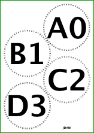 |
| `/Diamonds`<br>Five glasses<br>`/A4` = 210mm&times;297mm | 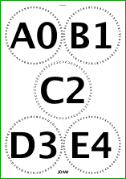 |
| `/Diamonds`<br>Thirteen glasses<br>`/A3` = 420mm&times;297mm |  |
| `/Diamonds`<br>Nine glasses<br>`/USLegal` = 14&Prime;&times;8&frac12;&Prime; | 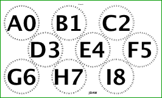 |
| `[ /Diamonds /Mirror ]`<br>Nine glasses<br>`/USLegal` = 14&Prime;&times;8&frac12;&Prime; | 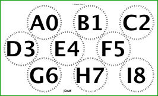 |

</div>

### RectangularDislocation

`/RectangularDislocation`: The next four examples are rectangular, optionally with a horizontal &lsquo;dislocation&rsquo; in the middle, that having, `/Diamonds`-style, circles lying between the circles in the adjacent row.

<div align="center">

| `PackingStyles` element<br>`PaperType` = *width*&times;*height* | Example |
|:---------------------------------------|:-------:|
| `/RectangularDislocation`<br>Five glasses<br>`/A4` = 210mm&times;297mm | 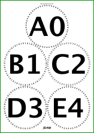 |
| `/RectangularDislocation`<br>Six glasses<br>`/A4` = 210mm&times;297mm | 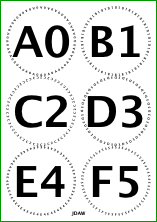 |
| `/RectangularDislocation`<br>Eleven glasses<br>`/A3` = 420mm&times;297mm | 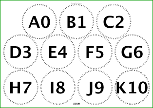 |
| `[ /RectangularDislocation /Mirror ]`<br>Eleven glasses<br>`/A3` = 420mm&times;297mm | 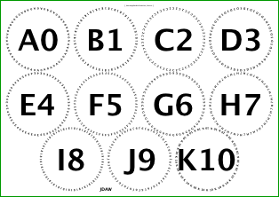 |

</div>

### SquareGrid

`/SquareGrid` can be similar to `/RectangularDislocation`. 
In the latter the glasses fill the page: observe the six-glass example above, in which the circles touch their vertical neighbours, but have a slight gap from the horizontal neighbour. 
In `/SquareGrid` there is no dislocation, and by default the vertical and horizontal distances are the same and equal to the diameter. 
`/SquareGrid` has two optional one-parameter flags: `/HorizontalAlignment` (which must have a value of one of `/Left`, `/Right`, `/Centre`, or `/Justify`); and `/VerticalAlignment` (one of `/Top`, `/Bottom`, `/Middle`, or `/Justify`). 
Obviously either `/Justify` can allow distances to differ.

<div align="center">

| `PackingStyles` element<br>`PaperType` = *width*&times;*height* | Example |
|:---------------------------------------|:-------:|
| `/SquareGrid`<br>Six glasses<br>`/A4` = 210mm&times;297mm | 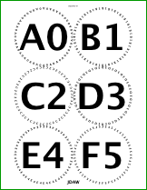 |

</div>

### DiamondsAndRectangular

`/DiamondsAndRectangular`: for some numbers of glasses and aspect ratios, the best fit can come from a pattern that is a combination of `/Diamonds` and a rectangular pattern. 
The diamonds can be offset from the diamonds either vertically or horizontally.

<div align="center" style="font-size: smaller;">

| `PackingStyles` element<br>`PaperType` = *width*&times;*height* | Example |
|:---------------------------------------|:-------:|
| `/DiamondsAndRectangular`<br>Fourteen glasses<br>`/A3` = 420mm&times;297mm | 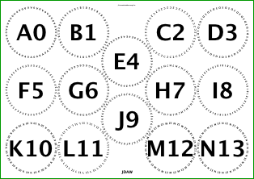 |
| `[ /DiamondsAndRectangular /RectColsToLeftOrRowsBelow 0 ]`<br>Fourteen glasses<br>`/A3` = 420mm&times;297mm | 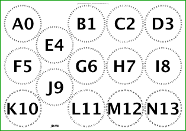 |
| `[ /DiamondsAndRectangular /RectColsToLeftOrRowsBelow 2 ]`<br>Fourteen glasses<br>`/A3` = 420mm&times;297mm | 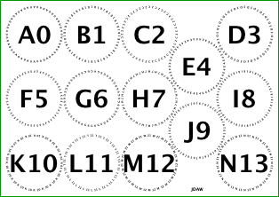 |
| `/DiamondsAndRectangular`<br>Fourteen glasses<br>`/USL2` = 17&Prime;&times;11&Prime; | 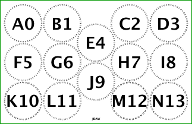 |
| `/DiamondsAndRectangular`<br>Nine glasses<br>`/USL2` = 14&Prime;&times;8&frac12;&Prime; | 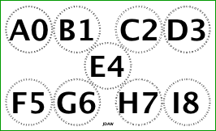 |

</div>

### DiamondsPlus

`/DiamondsPlus` is mostly three-row diamonds (or, if `/Portrait`, three-column), with two extras set between the three rows (columns). 
It is the best packing of seven or ten glasses on several paper sizes.

There is a generalisation of `/DiamondsPlus` over any number of rows (columns), [not yet coded](https://github.com/jdaw1/placemat/issues/38).

<div align="center">

| `PackingStyles` element<br>`PaperType` = *width*&times;*height* | Example |
|:---------------------------------------|:-------:|
| `/DiamondsPlus`<br>Seven glasses<br>`/A4` = 210mm&times;297mm | 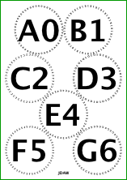 |

</div>

### RectangularAlternateNudge

`/RectangularAlternateNudge`: in this rectangular variant, alternate rows (or columns) are slightly nudged, better to fill the space.

Thus `/RectangularAlternateNudge` is a small deviation away from greater symmetry, about which the the author is unenthusiastic. 
Because of this non-enthusiasm, by default, `/RectangularAlternateNudge` comes with a sub-parameter: `[ /RectangularAlternateNudge /ImprovementPointsMin 2 ]`. 
This imposes an additional requirement: this packing style is chosen only if it is an improvement on the previous best radius of &ge;&nbsp;2pt &asymp;&nbsp;0.7mm. 

The next table of examples shows six glasses on `/USL` = 8&frac12;&Prime;&times;11&Prime; and on `/A4` = 210mm&times;297mm, in all cases with margins of 24pt = &#8531;&Prime; and space of 6pt for the header. 
It shows four packing styles: `/Diamonds`; `/SquareGrid`; `/RectangularDislocation`; and `/RectangularAlternateNudge`. 

So the radius improves by &asymp; 2.6pt&nbsp;&asymp;0.9mm, and hence the diameter by &asymp; 1.8mm. 
But on `/A4` the improvement in the radius is much less: only &asymp; 0.28pt &asymp; 0.098mm, which seems insufficient to justify the asymmetry&rsquo;s aesthetic damage.

<div align="center"  style="font-size: smaller;">

| `/USL`:<br>pt; inch; mm | `/USL` =<br>8&frac12;&Prime;&times;11&Prime; | `/A4`:<br>pt; inch; mm | `/A4` =<br>210mm&times;297mm |
|:------:|:------:|:-----:|:-----:|
| `/Diamonds`<br> on `/USL`<table><tr><th>Rad.</th><th>Diam.</th></tr><tr><td>117.46</td><td>234.93pt</td></tr><tr><td>1.631</td><td>3.263&Prime;</td></tr><tr><td>41.44</td><td>82.88mm</td></tr></table> | 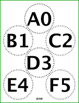 | `/Diamonds`<br> on `/A4`<table><tr><th>Rad.</th><th>Diam.</th></tr><tr><td>119.57</td><td>239.15pt</td></tr><tr><td>1.661</td><td>3.322&Prime;</td></tr><tr><td>42.18</td><td>84.37mm</td></tr></table> | 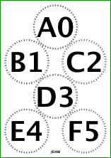
| `/SquareGrid`<br> on `/USL`<table><tr><th>Rad.</th><th>Diam.</th></tr><tr><td>123</td><td>246pt</td></tr><tr><td>1.708</td><td>3.417&Prime;</td></tr><tr><td>43.39</td><td>86.78mm</td></tr></table> |  | `/SquareGrid`<br> on `/A4`<table><tr><th>Rad.</th><th>Diam.</th></tr><tr><td>131.31</td><td>262.63pt</td></tr><tr><td>1.824</td><td>3.648&Prime;</td></tr><tr><td>46.33</td><td>92.65mm</td></tr></table> | 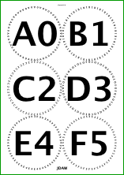
| `/RectangularDislocation`<br> on `/USL`<table><tr><th>Rad.</th><th>Diam.</th></tr><tr><td>123</td><td>246pt</td></tr><tr><td>1.708</td><td>3.417&Prime;</td></tr><tr><td>43.39</td><td>86.78mm</td></tr></table> | 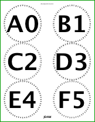 | `/RectangularDislocation`<br> on `/A4`<table><tr><th>Rad.</th><th>Diam.</th></tr><tr><td>131.31</td><td>262.63pt</td></tr><tr><td>1.824</td><td>3.648&Prime;</td></tr><tr><td>46.33</td><td>92.65mm</td></tr></table> | 
| `/RectangularAlternateNudge`<br> on `/USL`<table><tr><th>Rad.</th><th>Diam.</th></tr><tr><td>125.57</td><td>251.14pt</td></tr><tr><td>1.744</td><td>3.488&Prime;</td></tr><tr><td>44.30</td><td>88.60mm</td></tr></table> | 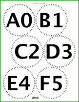 | `/RectangularAlternateNudge`<br> on `/A4`<table><tr><th>Rad.</th><th>Diam.</th></tr><tr><td>131.59</td><td>263.18pt</td></tr><tr><td>1.828</td><td>3.655&Prime;</td></tr><tr><td>46.42</td><td>92.85mm</td></tr></table> | 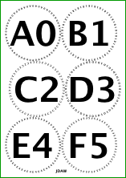

</div>


### RectangularAlternateSplitNudge

`RectangularAlternateSplitNudge`, by making the nudged rows go in both directions, lessens the aesthetic damage of the non-`Split` nudge, but makes an even smaller gain in the radius. 

<div align="center">

| `PackingStyles` element<br>`PaperType` = *width*&times;*height* | Example |
|:---------------------------------------|:-------:|
| `/RectangularAlternateSplitNudge`<br>Ten glasses<br>`/USL2` = 17&Prime;&times;11&Prime; | 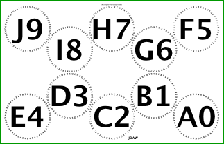 |
| `/RectangularAlternateSplitNudge`<br>Twelve glasses<br>`/USL2` = 17&Prime;&times;11&Prime; | 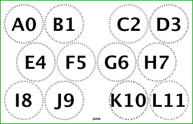 |
| `[ /RectangularAlternateSplitNudge /Mirror ]`<br>Twelve glasses<br>`/USL2` = 17&Prime;&times;11&Prime; | 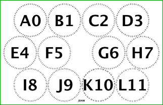 |

</div>

Both `/RectangularAlternateSplitNudge` and `/RectangularAlternateNudge` admit use of flags `/ProhibitVerticalNudging` or `/ProhibitHorizontalNudging`. 
Obviously using both would be strange.


### Bespoke5 and Bespoke7

`/Bespoke5` and `/Bespoke7` are ignored for more than five and seven glasses, respectively.

<div align="center">

| `PackingStyles` element<br>`PaperType` = *width*&times;*height* | Example |
|:---------------------------------------|:-------:|
| `/Bespoke5`<br>Five glasses<br>`/A4` = 297mm&times;210mm | 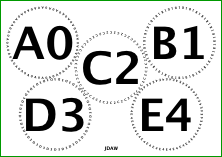 |
| `[ /Bespoke5 /Mirror ]`<br>Five glasses<br>`/A4` = 297mm&times;210mm | 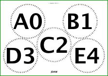 |
| `/Bespoke7`<br>Seven glasses<br>`/USLegal` = 14&Prime;&times;8&frac12;&Prime; | 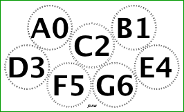 |
| `[ /Bespoke7 /Mirror ]`<br>Seven glasses<br>`/USLegal` = 14&Prime;&times;8&frac12;&Prime; | 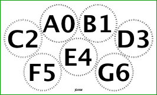 |

</div>

### Temple

`/Temple` is an intricate pattern, that has the largest radius for 10 glasses on `/USL`, and for 13 glasses on either `/USLegal` or `/USL2`. 
The sub-parameter `/TempleExtraColsToLeftOrRowsBelow` is followed by one integer, and is to `/Temple` as `/RectColsToLeftOrRowsBelow` is to `/DiamondsAndRectangular`.

<div align="center">

| `PackingStyles` element<br>`PaperType` = *width*&times;*height* | Example |
|:---------------------------------------|:-------:|
| `/Temple`<br>Ten glasses<br>`/USL` = 8&frac12;&Prime;&times;11&Prime; | 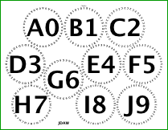 |
| `/Temple`<br>Thirteen glasses<br>`/USLegal` = 14&Prime;&times;8&frac12;&Prime; | 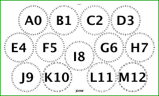 |
| `/Temple`<br>Thirteen glasses<br>`/USL2` = 17&Prime;&times;11&Prime; | 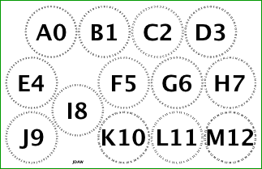 |

</div>

## Inefficient packings

There are classes of packing which, though they can have decorative or other advantages, are not space efficient.

### PostsAndLintel, and Arch

`/PostsAndLintel` arranges the circles around the left, top and right edges of the page, optionally with some circles at the bottom centre. 
This design might be particularly appropriate if the central circles held the candidate blends of a vintage, with some of the components around the edge. 
`/Arch` is similar, with the circles on a half ellipse.

<div align="center">

| `PackingStyles` element<br>`PaperType` = *width*&times;*height* | Example |
|:---------------------------------------|:-------:|
| `[ /Arch /CentralGlasses 3 ]`<br>Seven + three = ten glasses<br>`/A3` = 420mm&times;297mm | 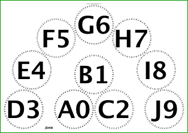 |
| `[ /PostsAndLintel /CentralGlasses 1 ]`<br>Seven + one = eight glasses<br>`/A3` = 420mm&times;297mm | 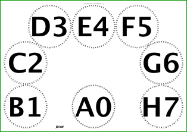 |
| `[ /PostsAndLintel /CentralGlasses 2 /Mirror ]`<br>Eight + two = ten glasses<br>`/A3` = 420mm&times;297mm | 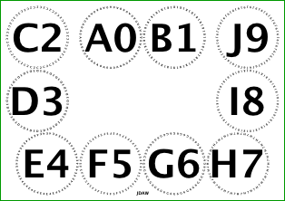 |

</div>

### Sides, LeftSide, RightSide, TopRow, MiddleRow, BottomRow

`/Sides`, `/LeftSide`, `/RightSide`, `/TopRow`, `/MiddleRow`, and `/BottomRow` are mostly self-explanatory. 

`/RightSide` (and, *mutatis mutandis*, `/LeftSide`) have a particular use. 
Consider a tasting with 17 glasses. 
This could be set as 6 + 6 + 5 on 3&times;`/A4`. 
But if table space were tight, 14 on 1&times;`/A3` and 3 on 1&times;`/RightSide` `/A4` would use only 2&frac12; `/A4` widths, if the unused half of the `/A4` were tucked under the `/A3`. 
Suppressing the ornaments tucked under the `/A3`, such as `HeadersCenter`, would look neater. 
This can be done by adding to the array an extra flag, `/SuppressNonRightOrnaments` (or `/SuppressNonLeftOrnaments`), which for the pages using that packing style suppresses the unwanted headers, footers, icons, and water boxes. 
Example item of PackingStyles: `[ /RightSide /GlassesNumMax 3 /SuppressNonRightOrnaments ]`.

<div align="center">

| `PackingStyles` element<br>`PaperType` = *width*&times;*height* | Example |
|:---------------------------------------|:-------:|
| `Sides`<br>Six glasses<br>`/A3` = 420mm&times;297mm | 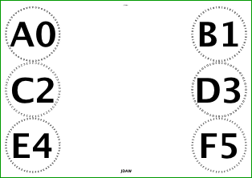 |
| `TopRow`<br>Four glasses<br>`/A3` = 420mm&times;297mm | 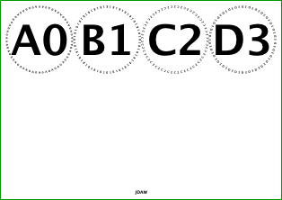 |
| `BottomRow`<br>Four glasses<br>`/A3` = 420mm&times;297mm | 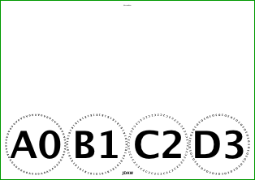 |
| `MiddlemRow`<br>Four glasses<br>`/A3` = 420mm&times;297mm | 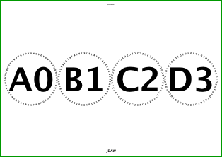 |
| `/LeftSide`<br>Three glasses<br>`/A4` = 297mm&times;210mm | 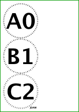 |
| `/RightSide`<br>Three glasses<br>`/A4` = 297mm&times;210mm | 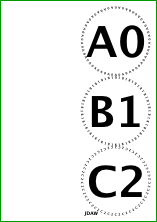 |

</div>

## Array: custom arrangements

It is possible to specify an arrangement with an array, thus:
```Postscript
[ /Array /Positions [0 2] [2 2] [4 2] [6 2]  [0 1] [3 1] [6 1]  [0 0] [3 0] [6 0] ]
```
The style is `/Array`. 
That can have any of the selection controls, such as `/OnlyIfOrientation /Landscape`. 
After which is `/Positions`. 
After the `/Positions` marker is a list of points, typically of the form `[x y]`, with *y* increasing up the page. 
The code then chooses the radius and separately scales the *x* and *y* directions such that things fit as snugly as possible, obviously subject to the other upper bounds on the radius. 
The glass ordering is that given in the array: there is no subsequent sorting or ordering.

There is a more complicated variant, in which some of the sub-arrays are of the form `[x y x' y']`. 
The first two elements are used, as before, and fix the radius and the canvas. 
The circle at (*x*,*y*) is then moved in a straight line towards (*x'*,*y'*). 
A circle stops moving if it collides with another circle (a tangential touch not being a collision); if it collides with the edge of the page; or it arrives at (*x'*,*y'*).

The example image shows, on `/A3`, an alternation of the previous code extract to:
```Postscript
[ /Array /Positions [0 2] [2 2 3 2] [4 2 3 2] [6 2]  [0 1] [3 1] [6 1]  [0 0] [3 0] [6 0] ]
```

<div align="center">

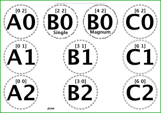

</div>

The difference is the movement of the circles at (2,2) and (4,2), both towards (3,2). 
For the author&rsquo;s taste, the closer relationship of the two B0 circles means they should be touching, rather than equally spaced between A0 and C0.

## Other flags, constraints, and sub-parameters

There are other flags and constraints and sub-parameters, as follows.

* `/Mirror`: the alternate chirality. 
If there isn&rsquo;t a sensible meaning to this, ignored.

* `/ShoveLeft` and `/ShoveRight`: if there is spare space between the circles, probably because the radius has been shrunk to that on another sheet, the circles are shoved leftwards (or rightwards) against that margin. 
But not heeded in every base style.

* `/PackingDirectionTopToBottom bool` and `/PackingDirectionLeftToRight bool` and `/PackingNestingColumnMajor bool`: by default most layouts start at the top-left, work across to the top-right, then start the second row slightly further down on the left. 
This can be changed: glasses can run right-to-left, bottom-to-top, and the nesting order of columns and rows can be exchanged. 
For large pre-poured tastings on `/A3` or `/USL2`, generally one pre-pours the youngest first. 
If these are in the front row, it is more fiddly to lower subsequent older vintages into place. 
Adding `/PackingNestingColumnMajor true` fixes this. 
(The global value of `PackingNestingColumnMajor` is the default value within PackingStyles, and also affects the ordering in Cork-Display pages.)

* `/ProhibitVerticalNudging` or `/ProhibitHorizontalNudging`: have the obvious effect in base styles `/RectangularAlternateNudge` and `/RectangularAlternateSplitNudge`.

* `/RectColsToLeftOrRowsBelow int` chooses the position of the diamonds-style block in `/DiamondsAndRectangular`.

* `/TempleExtraColsToLeftOrRowsBelow int` chooses the position of the &lsquo;hole&rsquo; in `/Temple`.

* `/CentralGlasses int`: both `/PostsAndLintel` and `/Arch` packings can have 0, 1, 2, or 3 glasses in the centre, the remainder running round the edge or semi-ellipse.

* `/RowsNumMin int` and `/RowsNumMax int`: minimum and maximum number of rows permitted. 
Relevant in the `/Diamonds`, `/RectangularDislocation`, `/SquareGrid`, `/RectangularAlternateNudge`, and `/PostsAndLintel` packing styles.

* `/OnlyIfSheetNumMin int` and `/OnlyIfSheetNumMax int`: specifying permitted values for the internal variable SheetNum, which is 0 on the first sheet, 1 on the second, etc.

* `/GlassesNumMin int` and `/GlassesNumMax int`: permitted number of glasses. 
If outside range, this packing specification not used.

* `/OnlyIfOrientation name`, the sub-parameter being one of `/Landscape`, `/Portrait`, or `/Either`, the last being the default if this sub-parameter absent. 
If `Orientation` not matching, this packing specification not used.

* `/ImprovementPointsMin num` and `/ImprovementProportionMin num`: this specification used only if beating previous best by the required amount, either absolute (e.g., 2 points) or as a proportion (e.g., 0.01 = 1%).

If `PackingStyles` is empty, or contains only invalid/impossible layouts, then instead several of the regular layouts are tried.


## Radius constraints

There is aesthetic merit in imposing that radii are consistent across pages within a single session. 
This is controled by `ShrinkRadii`, which can be:
* `/NotAtAll`, which leaves each page at its own best possible;
* `/ToSmallestSamePageOrdering`, which ensures consistency within each session;
* `/ToSmallest`, which ensures consistency over the whole document;
* `[ 0 0 0 … 1 1 1 … 2 2 ]`, which is an arbitrary array of the same length as `GlassesOnSheets`, pages&rsquo; radii being forces to their lesser if elements satisfy PostScript&rsquo;s `eq` condition.

There is also the simple numerical parameter `MaxRadius`, defaulting to 150 &rArr; diameter &le;&nbsp;300pt =&nbsp;4&#8537;&Prime; =&nbsp;105&#8538;mm.


## Page size and glass diameters

Given the default value of `PackingStyles`, the following shows glass diameters for various numbers of glasses on various page sizes.

| Num<br>Glasses | `/A4`<br>210mm&times;297mm | `/A3`<br>420mm&times;297mm | `/USLegal`<br>14&Prime;&times;8&frac12;&Prime; | `/USLegal`<br>8&frac12;&Prime;&times;11&Prime; | `/USL2`<br>17&Prime;&times;11&Prime; |
|---:|---:|---:|---:|---:|---:|
| 3 | 113.9mm, 4.49&Prime; | 164.6mm, 6.48&Prime; | 126.9mm, 5.00&Prime; | 113.1mm, 4.45&Prime; | 161.1mm, 6.34&Prime; |
| 4 | 105.1mm, 4.14&Prime; | 151.6mm, 5.97&Prime; | 112.8mm, 4.44&Prime; | 105.6mm, 4.16&Prime; | 145.6mm, 5.73&Prime; |
| 5 | 96.5mm, 3.80&Prime; | 140.0mm, 5.51&Prime; | 106.9mm, 4.21&Prime; | 96.6mm, 3.80&Prime; | 138.3mm, 5.45&Prime; |
| 6 | 92.7mm, 3.65&Prime; | 134.4mm, 5.29&Prime; | 101.4mm, 3.99&Prime; | 88.6mm, 3.49&Prime; | 130.2mm, 5.13&Prime; |
| 7 | 81.1mm, 3.19&Prime; | 117.2mm, 4.61&Prime; | 92.7mm, 3.65&Prime; | 79.3mm, 3.12&Prime; | 116.4mm, 4.58&Prime; |
| 8 | 77.2mm, 3.04&Prime; | 111.2mm, 4.38&Prime; | 87.0mm, 3.42&Prime; | 76.5mm, 3.01&Prime; | 109.7mm, 4.32&Prime; |
| 9 | 72.8mm, 2.87&Prime; | 105.0mm, 4.13&Prime; | 78.7mm, 3.10&Prime; | 73.2mm, 2.88&Prime; | 101.3mm, 3.99&Prime; |
| 10 | 70.7mm, 2.78&Prime; | 100.8mm, 3.97&Prime; | 76.7mm, 3.02&Prime; | 67.2mm, 2.64&Prime; | 97.2mm, 3.83&Prime; |
| 11 | 69.5mm, 2.74&Prime; | 100.8mm, 3.97&Prime; | 75.1mm, 2.96&Prime; | 66.3mm, 2.61&Prime; | 97.2mm, 3.83&Prime; |
| 12 | 64.4mm, 2.53&Prime; | 94.7mm, 3.73&Prime; | 72.8mm, 2.86&Prime; | 65.1mm, 2.56&Prime; | 92.2mm, 3.63&Prime; |
| 13 | 62.9mm, 2.47&Prime; | 91.0mm, 3.58&Prime; | 68.8mm, 2.71&Prime; | 60.7mm, 2.39&Prime; | 87.7mm, 3.45&Prime; |
| 14 | 59.7mm, 2.35&Prime; | 86.4mm, 3.40&Prime; | 67.7mm, 2.67&Prime; | 57.9mm, 2.28&Prime; | 86.8mm, 3.42&Prime; |
| 15 | 58.1mm, 2.29&Prime; | 83.9mm, 3.30&Prime; | 65.6mm, 2.58&Prime; | 56.8mm, 2.24&Prime; | 83.0mm, 3.27&Prime; |
| 16 | 55.7mm, 2.19&Prime; | 80.4mm, 3.16&Prime; | 60.4mm, 2.38&Prime; | 55.9mm, 2.20&Prime; | 77.6mm, 3.06&Prime; |
| 17 | 54.1mm, 2.13&Prime; | 78.0mm, 3.07&Prime; | 58.2mm, 2.29&Prime; | 52.1mm, 2.05&Prime; | 75.0mm, 2.95&Prime; |
| 18 | 54.1mm, 2.13&Prime; | 78.0mm, 3.07&Prime; | 58.2mm, 2.29&Prime; | 52.1mm, 2.05&Prime; | 75.0mm, 2.95&Prime; |
| 19 | 50.5mm, 1.99&Prime; | 75.5mm, 2.97&Prime; | 56.4mm, 2.22&Prime; | 49.7mm, 1.96&Prime; | 73.1mm, 2.88&Prime; |
| 20 | 50.5mm, 1.99&Prime; | 73.3mm, 2.89&Prime; | 56.4mm, 2.22&Prime; | 49.7mm, 1.96&Prime; | 73.1mm, 2.88&Prime; |
| 21 | 48.3mm, 1.90&Prime; | 69.5mm, 2.74&Prime; | 55.1mm, 2.17&Prime; | 49.1mm, 1.93&Prime; | 69.2mm, 2.72&Prime; |

Measure the diameter of your glasses. 
Add something for two fingers. 
Add something for the inebriation of the owner of the fingers. 
Suggestion: &le;6 on `/A4`; &le;15 on `/A3`; &le;8 on `/USLegal`; &le;6 on `/USL`; &le;15 on `/USL2`. 
But sometimes table space is a binding constraint, in which case there must be less paper area, hence smaller circles.

The images show the packings for the diameters &le;&nbsp;4&frac12;&Prime; &asymp;&nbsp;114mm, down to slightly below 3&Prime; &asymp;&nbsp;76mm.

[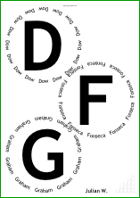](images/HowManyGlasses_A4.pdf) 
[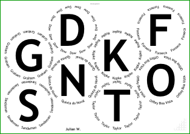](images/HowManyGlasses_A3.pdf) 
[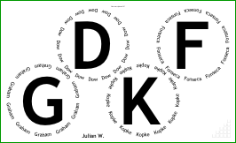](images/HowManyGlasses_USLegal.pdf) 
[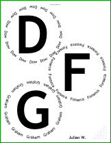](images/HowManyGlasses_USL.pdf) 
[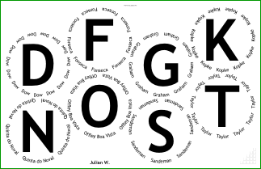](images/HowManyGlasses_USL2.pdf) 

## Code extracts

Some extracts from the code used to make some of examples on this page.

```Postscript
/ThePortForumIconPlacement /None def

/VoteRecorders false def
/CorkDisplayNumCopies 0 def
/NeckTagsNumCopies 0 def
/TastingNotePagesNumCopies 0 def
/DecantingNotesNumCopies 0 def

/TitlesFont     /LucidaGrande-Bold def
/CircletextFont /LucidaGrande-Bold def
/HeaderFont     /LucidaSans-TypewriterBold def

/FontSizesRatioTitlesMin 999 def

/CircletextsMinNumSpacesBetween 1.5 def
/CircletextMaxFontSizeAbsolute 12 def

/InlineTitles false def

/WaterBoxes /None def

/ShrinkRadii /NotAtAll def
/MaxRadius 9999 def

/OutputLogToPage false def
```
