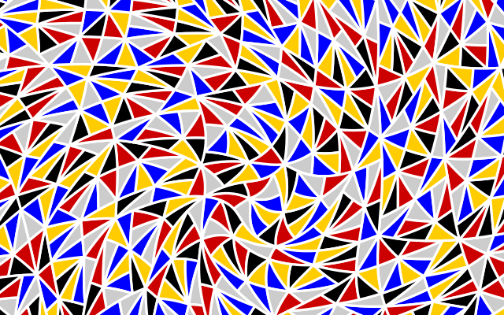

# Bitmap images

**Documents**: 
1.  [Introduction, and a first placemat](introduction_first_placemat.md);  
2.  [Compound Strings and non-ASCII characters](compound_strings_characters.md);  
3.  [Fonts and glass decoration](fonts_glasses_decoration.md);  
4.  [Type sizes](type_sizes.md);  
5.  [Page-level controls](page_level.md);  
6.  [Arrangement of glasses on the page](PackingStyles.md);  
7.  [Non-Glasses Pages](not_glasses.md);  
8.  [Document-level controls](document.md);  
9.  [Code injection](code_injection.md);  
10.  *Bitmap images*;
11. [Translations](translations.md);
12. [Debugging](debugging.md).

----

<div style="clear: both;"></div>

## Introduction

Adding bitmap images is difficult. 
It is painful. 
Unless you absolutely must, don&rsquo;t. 

This document is for those who must.

## Make an EPS

The image needs to be in PostScript. 
Start with an image, appropriately cropped. 
The image you want is probably a brand logo, but we&rsquo;ll use two images, one colour, one gray ([source](http://www.jdawiseman.com/papers/games/steiner_hexads/steiner_hexads.html)).

<div align="center">




</div>

Print the image to EPS from a paint program. 
Some make messy EPS, which is even more difficult than otherwise needed. 
Henceforth it will be assumed that the EPS has been generated by [Lemke Software&rsquo;s GraphicConverter](http://www.lemkesoft.de/en/products/graphicconverter/): &#655;&#7437;&#7437;&#7456;.

Resulting EPS files: 
[colour](images/ImageColour_example.eps); 
[gray](images/ImageGray_example.eps). 

## PostScript

Let&rsquo;s show the code:
```PostScript
/PaintBackgroundCode
{
	TypeOfPagesBeingRendered /Glasses eq
	{
		SheetNum -1 gt  % This condition always true, but a tighter condition could be used.
		{
			% Image centre, in this example, uses GlassPositions. But x value could have been PageWidth MgnL MgnR sub add 2 div.
			GlassPositions SheetNum get 1 get 0 get  GlassPositions SheetNum get 2 get 0 get  add 2 div  % x (hence ... 0 get)
			GlassPositions SheetNum get 2 get 1 get  GlassPositions SheetNum get 4 get 1 get  add 2 div  % y (hence ... 1 get)
			translate

			% DeviceRGB or DeviceGray, depending on whether image RGB or greyscale.
			/DeviceRGB setcolorspace

			% Width and height known from image. Also in EPS.
			% Resolution: not too small.
			% But, settings dependent, some PS->PDF software down-resolutions large pictures. For such setting, high resolution is needless.
			<< /width 640 /height 400 >> begin
				% Scaling determined by trial and error, or by computation in the PostScript, or otherwise.
				0.1576991 dup scale

				% Need lower-left of image, but "translate" seven lines up chose desired centre.
				width -2 div height -2 div translate
				<<
					/DataSource  ImageColour_data << >> /DCTDecode filter  % data source usually needs changing
					ImageColour_data 0 setfileposition  % data source usually needs changing
					/ImageType 1
					/Width width
					/Height height
					/ImageMatrix [1 0 0 -1 0 height]
					/BitsPerComponent 8
					/Decode [ currentcolorspace 0 get /DeviceGray eq {0 1} {0 1 0 1 0 1} ifelse ]
				>> image
			end  % << /width ... /height ... >>
		} if  % ... SheetNum ...
	} if  % Glasses page
} def  % /PaintBackgroundCode


/PaintBackgroundInsideGlassCircles
{
	//false  [ /Glasses /TastingNotes /PrePour /NeckTags ] {TypeOfPagesBeingRendered eq {pop //true exit} if} forall  % /DecanterLabels excluded.
	{
		WithinTitles 0 eq  % Example condition. YMMV.
		{
			% DeviceRGB or DeviceGray, depending on whether image RGB or greyscale.
			/DeviceGray setcolorspace

			% Width and height known from image. Also in EPS.
			% Resolution: not too small.
			% But, settings dependent, some PS->PDF software down-resolutions large pictures. For such setting, high resolution is needless.
			<< /width 640 /height 400 >> begin
				% Scaling determined by trial and error, or by computation in the PostScript, or otherwise.
				RadiiCirclearrayInside SheetNum get  width dup mul height dup mul add sqrt 2 div  div dup scale

				% Need lower-left of image, but "translate" seven lines up chose desired centre.
				width -2 div height -2 div translate
				<<
					/DataSource  ImageGray_data << >> /DCTDecode filter  % data source usually needs changing
					ImageGray_data 0 setfileposition  % data source usually needs changing
					/ImageType 1
					/Width width
					/Height height
					/ImageMatrix [1 0 0 -1 0 height]
					/BitsPerComponent 8
					/Decode [ currentcolorspace 0 get /DeviceGray eq {0 1} {0 1 0 1 0 1} ifelse ]
				>> image
			end  % << /width ... /height ... >>
		} if  % WithinTitles ...
	} if  % /Glasses ...
} bind def  % /PaintBackgroundInsideGlassCircles 


/ImageGray_data
currentfile
<< /Filter /ASCIIHexDecode  /Intent 0 >>
/ReusableStreamDecode filter
FFD8FFE000104A46494600010100004800480000FFE100404578696600004D
4D002A00000008000187690004000000010000001A000000000002A0020004
% !!!   2477 lines removed   !!!
7F1647527BA8E878240C1AD0B7B048A4FB4DC39B8B9FF9E8DFC39EA117A28F
A727B935FFD9
>    % End-of-data marker for ASCIIHexDecode data. Observe previous line doesn't end in ">".
def  % /ImageGray_data


/ImageColour_data
currentfile
<< /Filter /ASCIIHexDecode  /Intent 0 >>
/ReusableStreamDecode filter
FFD8FFE000104A46494600010100004800480000FFE100404578696600004D
4D002A00000008000187690004000000010000001A000000000002A0020004
% !!!   6101 lines removed   !!!
1F4E7DF9C57F865E22F8B593F0CD2FF6EA97AAF6A71D64FD7F9579BB795DE8
7EBB92F0EE271D2FDD2B47AB7B7FC1F447FFD9
>    % End-of-data marker for ASCIIHexDecode data. Observe previous line doesn't end in ">".
def  % /ImageColour_data
```

It is intended that much of this can be copy-pasted, with small alterations, into the code for your placemats. 

There are four blocks of action: `PaintBackgroundCode`, `PaintBackgroundInsideGlassCircles`, `ImageGray_data`, `ImageColour_data`. 
These are tackled in reverse order. 
  
### Image data blocks

There are two blocks of image data.
* They start with the name of the variable that will hold this data. In this example the unimaginative names are `/ImageGray_data` and `/ImageColour_data`.
* Then there are three lines to be quoted vertabim. (If you must, see [p15](http://www.acumentraining.com/Acumen_Journal/AcumenJournal_Dec2002.zip) and [p9](http://www.acumentraining.com/Acumen_Journal/AcumenJournal_Jan2003.zip).) 
* The gray-scale image had 2481 lines of data; the colour image had 6105 lines. Likely as not, your images will have a different number of lines.
* The image data is terminated with a &ldquo;>&rdquo;. My preference has been that this starts a new line, but that newline is optional. 
* And then a `def`, which attaches that block of data to the variable name, 

### PaintBackgroundInsideGlassCircles and PaintBackgroundCode

`PaintBackgroundInsideGlassCircles` and `PaintBackgroundCode` are code-injection parameters, with a default do-nothing value of `{}`. 
As with any other parameter, if giving them new values, don&rsquo;t forget to remove the lines setting their default values. 
These two parameters are to hold code, which may do arbitrary computation, and which may paint on the page.

<div align="center">


</div>

### PaintBackgroundInsideGlassCircles

`PaintBackgroundInsideGlassCircles` is executed each time a glass circle is painted. 
On execution, the graphic matrix will have already been translated such that the centre of the circle is at (0,0).

The code has a test involving `TypeOfPagesBeingRendered`: on what page types should the grayscale image appear?

* Of course, the glasses page?
* The glasses-page circles are reproduced, faded, on the tasting notes page. 
Is the image wanted there?
* The glasses-page circles are reproduced on the pre-pour pages. 
Is the image wanted there?
* And the various titles types, but not the circle of text, are on the neck-tag pages, and on the decanter labels. 
Is the image wanted on either of those? 
Hence page type is tested.
* Is the image wanted for all wines, or only for those for which this is the correct brand logo? 
The example selects only the first: `WithinTitles 0 eq`. 
* Is the image colour or gray? The former has three times the amount of data, so this knowledge is needed, and imparted with `/DeviceGray setcolorspace` or `/DeviceRGB setcolorspace`.
* Update `<< /width 640 /height 400 >>` to match the pixel dimensions of the bitmap.
* The image needs to be `scale`d. If being scaled by equal amounts in both directions, as is usual, the multiplier can be computed and followed by `dup scale`. The example is scaled to fit precisely inside the circle: `RadiiCirclearrayInside SheetNum get  width dup mul height dup mul add sqrt 2 div  div`, which works well for an image the contents of which are conveniently rectangular. But trial-and-error isn&rsquo;t bad: guess 0.5; guess 0.02; go from there.
* We want the point (0,0) to be the centre of the image, not its lower-left, which is done with `width -2 div height -2 div translate`. 
* Finally, ensure that the chosen image data variable (`ImageGray_data`) is the correct variable.

### PaintBackgroundCode

`PaintBackgroundCode` is only slightly different to `PaintBackgroundInsideGlassCircles`.
* It exists at the page level, so `WithinTitles` and `WithinPage` should not be referenced. 
* On which sheet numbers should this appear? The demonstration code has a mock condition, `SheetNum -1 gt`, which is always true.
* Need to `translate` to the desired point on the page. In this example it references `GlassPositions SheetNum get`, which is of the form `[ [x0 y0] [x1 y1] … ]`, but the *x* value could have been `MgnL MgnR sub PageWidth add 2 div`. 
* Colour image, so `/DeviceRGB setcolorspace`.
* And in this example, the `scale` comes directly as a number, `0.1576991 dup scale`, rather than being computed in the PostScript. 
As before, trial-and-error suffices (though Mathematica is more precise).

## Conclusion

Adding bitmap images is difficult. 
Unless you absolutely must, don&rsquo;t. 

But if you must, then you must. 
Do it well. 
Good luck.
