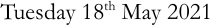
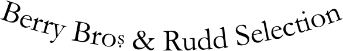
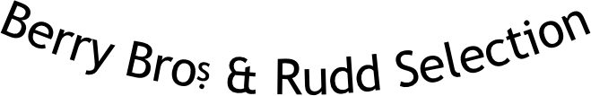
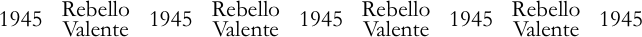
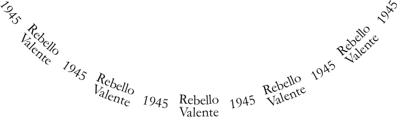
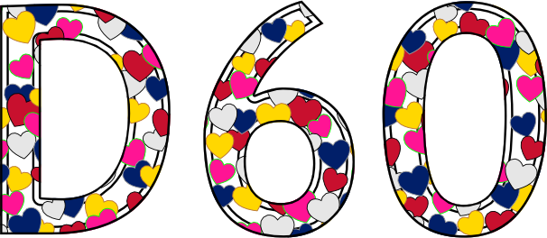

# Code injection

**Documents**: 
1.  [Introduction, and a first placemat](introduction_first_placemat.md);  
2.  [Compound Strings and non-ASCII characters](compound_strings_characters.md);  
3.  [Fonts and glass decoration](fonts_glasses_decoration.md);  
4.  [Type sizes](type_sizes.md);  
5.  [Page-level controls](page_level.md);  
6.  [Arrangement of glasses on the page](PackingStyles.md);  
7.  [Non-Glasses Pages](not_glasses.md);  
8.  [Document-level controls](document.md);  
9.  *Code injection*;  
10. [Bitmap images](bitmap_images.md).

----

<div style="clear: both;"></div>

## Introduction

The software allows, even encourages, code injection. 
this document gives some examples of this. 

Mostly, this document describes what may be done with code inside compound strings. 

However, other parameters are intended to hold code: 
* To `stroke` lines (e.g., `SpiralStrokeCode`, `ShapesTitlesStroke`, `CrossHatchingOutsideStrokeCode`, `TastingNotesColumnStrokeCode`);
* To make a more general use of a path (e.g., `BackgroundTextsGlassesPaintCode`, `FlightSeparationPaintCode`, `CirclearraysFillBehindCode`);
* And without a path being provided, as a generic code-injection point (e.g., `PrologueCode`, `EpilogueCode`, `PaintBackgroundCode`, `PaintForegroundCode`, `PaintBackgroundInsideGlassCircles`). 

Further, the majority of the several hundred parameters may hold code.

## Difficulties

Much software has a clear specification. 
If the input meets the specification, the output will behave as promised. 

Indeed, that is at least partly true of this software. 

But not with code injection. 
E.g., assume a tasting is of several vintages of three wines. 
The makers of the three wines each have their own branding, each in a different font. 
It would be entirely natural to define something like `/CircletextFont {Circlearrays WithinTitles get 0 get dup (WineA) eq {pop /FontA} {(WineB) eq {/FontB} {/FontC} ifelse} ifelse} def`. 


Except that the default values of `NamesFont` and `HeaderFont` use `{CircletextFont}`. 
Typically these are used outside a `WithinTitles` loop, so `WithinTitles` won&rsquo;t be defined, and this fails. 
Yes, these errors can be located via &#8984;F and trial-and-fail. 
But the point is that code injection is not always cleanly defined.

It might also be that, occasionally in the software, work is done with a usually-constant parameter outside a loop, when it could be done inside. 
Multiple instances of this &lsquo;bug&rsquo; have been discovered in the past. 

## Code inside compound strings

### Summary

Almost any &lsquo;string&rsquo; parameter may be a &lsquo;[compound string](compound_strings_characters.md)&rsquo;. 
The exception are URLs, as appear in `ExternalLinks` and `LicensingAgreementLinkPlacemats`. 

The code in a compound string may do any of the following.
* Put on the stack &ge;0 further compound strings to be painted.
* `rmoveto` the currentpoint, probably by an amount proportional to `CurrentFontSize` (for the horizontal direction of which there is a shortcut: `{-0.09 Kern}` being equivalent to `{-0.09 CurrentFontSize mul 0 rmoveto}`).
* Change the current font or size, probably by `selectfont`, and to a size proportional to `CurrentFontSize`, and after storing the original status to permit reversion.
* Draw a shape, of a size proportional to `CurrentFontSize`, at the current point, and leaving an extant current point at its lower-right. 
Such a shape should be `fill`ed, but non-`bind`edly, so that `fill` can be redefined to allow the software to establish the size of the shape.

When user code within compound strings is being executed the current dictionary is `UserScratchDict`, which persists between executions of such user code. 
`UserScratchDict` will therefore hold any variables `def`&rsquo;d. 
To avoid name clashes users should not `store` anything.

Code inside compound strings may assume that there is a `currentpoint` and a current font, and this should still be true after execution. 
Any changes made by the code to the current path should be made by `rmoveto`, `rlineto`, and `rcurveto`; code should not alter the dictionary stack; nor alter anything that was on the stack at the start of code execution; nor leave changed the `currentmatrix`; nor change any of the many code variables.
But the software does not prevent the user doing any of this: if you don&rsquo;t want to do these terrible things, just don&rsquo;t.

## Examples

### Kerning

Some pairs of letters look better if nudged closer together. This is particularly true with an x-height letter either side of a &lsquo;W&rsquo; or a &lsquo;V&rsquo;, and even more if either of the neighbouring characters is an &lsquo;A&rsquo;. 
E.g.:
* `[(W) {-0.06 Kern} (arre)]`
* `[(T) {-0.06 Kern} (aylor)]`
* `[(Smith W) {-0.06 Kern} (oodhouse)]`
* `[(JDA) {-0.06 Kern} (W)]`

Obviously, the optically best kern amount varies by font.

### Superscript

To help with superscripting there are routines `SuperscriptOn` and `SuperscriptOff`:
* `[(T) {-0.08 Kern} (uesday 18) {SuperscriptOn} (th) {SuperscriptOff} ( May 2021)` =<br>

### Typeface changing

A compund string may change the current font:
```PostScript
[ 
	{/Garamond CurrentFontSize selectfont}         (This is in Garamond; )
	{/TrebuchetMS-Bold CurrentFontSize selectfont} (this is in TrebuchetMS-Bold; )
	{/Garamond CurrentFontSize selectfont}         (and then back to Garamond.)
]
```

### Wine dependence

If a tasting comprises two or three different types of wine, a subtle formatting variation between them can be elegant. 
However, the variation should not more than slightly change the lightness or darkness, because doing so would impede comparison of wines. 

The examples are self explanatory.

```PostScript
/InlineTitlesMaxNumberContours {Belowtitles WithinTitles get (LBV) eq {2} {1} ifelse} def
```

```PostScript
/ShapesFlowersNumPetalsMin {Circlearrays WithinTitles get 1 get (LBV) eq {5} {6} ifelse} def
/ShapesFlowersNumPetalsMax {ShapesFlowersNumPetalsMin} def
```

```PostScript
/DecanterLabelsNumCopies
{
	Belowtitles WithinTitles get  dup
	(Tappit Hen) eq
		{pop 3}
		{(Magnum) eq {2} {1} ifelse}
	ifelse
} def  % /DecanterLabelsNumCopies
```

If the string needs kerning, then at the start assign it to a variable with the likes of `
/TappitHen [(T) {-0.06 Kern} (appit Hen)] def`; use in `/Belowtitles [ … () … TappitHen … ] def`; and test for equality to `TappitHen` rather than to the string `(Tappit Hen)`.

Of course, variation can be purely decorative.

```PostScript
/SpiralCentreFromCentreProportionRadiiInside 0.75 def
/SpiralCentreFromCentreAngle {360 WithinTitles 1 add mul Circlearrays length div} def
```


## Variables that parameters may inspect

Many parameters may be set to code, and this code may access internal variables. 
Multiple variables can be available for use.

* At the page level:

	- `TypeOfPagesBeingRendered`, possible values including:
		* `/Glasses`; 
		* `/TastingNotes`; 
		* `/PlaceName`; 
		* `/PrePour`; 
		* `/StickyLabels`; 
		* `/VoteRecorder`; 
		* `/DecantingNotes`; 
		* `/Accounts`; 
		* `/CorkDisplay`; 
		* `/DecanterLabels`; and 
		* `/Multiple` if doing calculations applicable to multiple types of page.

	- `PageWidth` and `PageHeight`, from which it might be necessary to subtract some of the current used margins: `MgnL`, `MgnR`, `MgnT`, `MgnB`. (Unless `SideBySideGlassesTastingNotes` is true, these will equal `MarginL`, `MarginR`, `MarginT`, `MarginB`.)

	- On glasses sheets, `SheetNum`, an integer being the item of `GlassesOnSheets` currently being rendered. This also exists on pre-pour, neck-tag, and sticky-label pages.

	- `Radii`, an array of reals holding the radii of the different glasses sheets. Also `RadiiCirclearrayBaseline` and `RadiiCirclearrayInside`, holding the distance from centre of the baseline and top of the `Circlearrays`.

	- `GlassPositions`, a triple-depth array holding the positions of the glasses. `GlassPositions SheetNum get WithinPage get` is an array, `[x y]`, the position of the centre of the glass placement. 

	- On tasting-note pages, `TastingSheetNum`, an integer being the item of `GlassesOnTastingNotePages` currently being rendered.

	- On place-name pages, PlaceNameSetNum, an integer being the number of the sub-array of NamesPlaceNames currently being rendered.

	- On pre-pour pages, `PrePourSheetNum`, an integer &ge;&nbsp;0 and &le;&nbsp;`PrePourNumCopies`&minus;1, being the number of the pre-pour sheet currently being rendered.

	- On sticky-label pages, StickyLabelCopyNum, an integer &ge;&nbsp;0 and &le;&nbsp;`StickyLabelsNumCopies`&minus;1, being the number of the sticky label currently being rendered.

	 - On vote-recorder pages, `VoteRecorderTopTextNum` and `VoteRecorderSheetNum`, less than the length of `GlassesClusteredOnVoteRecorders`.

	- On decanting-notes pages, `DecantingNotesCopyNum`, an integer &ge;&nbsp;0 and &le;&nbsp;`DecantingNotesNumCopies`&minus;1, being the number of the copy of the page. Also `DecantingNotesSheetNum`, less than the length of `GlassesClusteredOnDecantingNotes`.

	- Within each neck tag, `NeckTagsCopyNum`. If a tasting as many people and hence multiple bottles of each wine, of which each person tastes only one, the tags could be numbered: `/CirclearraysNeckTags [ Circlearrays {[ exch aload pop [(Bottle #) {NeckTagsCopyNum 1 add}] ]} forall ] def`. 

	- `CircletextMaxFontSizes`, an array of reals with `CircletextMaxFontSizes SheetNum get` being the usual font size in which the `Circlearrays` are rendered (though the font size of any particular circle text might have been shrunk by `CircletextsMinCopies`, or altered by code within `Circlearrays`).

	- `TitleFontSizes` and similar variables `AbovetitleFontSizes`, `BelowtitleFontSizes`, and `OvertitleFontSizes`, being nested arrays, the same shape as `GlassesOnSheets`. They contain the sizes of the font at the start of rendering the `Titles` etc.

	- `NameNum`, an integer being the item of Names the page of which is being rendered, and `ThisName`, being `Names NameNum get`. Most things may **not** vary by `NameNum`. In particular, not elements of `Titles`, `Abovetitles`, `Belowtitles`, `Overtitles`, `FillTexts`, etc, nor their layout or formatting. So if trying to vary something by `NameNum` do test, and expect failure.

* At the individual glass level (and thus available to glass-level settings such as `InlineTitlesMaxNumberContours`, as well as to one-glass situations such as the pre-pour pages) there will also be: 

	- `WithinPage`, being number of the glass on this page, thus running from zero to one less than the number of glasses on page `SheetNum` or `TastingSheetNum`.

	- `WithinTitles`, being number of item in the array `Titles` (and hence also of `Circlearrays`, `Abovetitles`, `Belowtitles`, `Overtitles`, `Subtitles`, and `FillTexts`).

* Special case: if `FlightSeparationPaintSeparately` then `FlightSeparationPaintCode` may read `FlightSeparationLineNum`.


## More examples

### Berry Bros & Rudd Selection

Berry Brothers&rsquo; name contains an abbreviation, shown as a small &lsquo;s&rsquo; above a dot. 
This entails writing some PostScript.

The code below starts by saving the current font size in `BrosOriginalFontSize`. 
Then it calculates the height of the &lsquo;s&rsquo; (using the handy `StringHeight` function), of the &lsquo;o&rsquo;, and the dot, from which it can deduce the font size such that the dot, a gap half height of the dot, and the &lsquo;s&rsquo;, in the new size, sum to the height of the &lsquo;o&rsquo; in the old, and also deduce the vertical offset of the &lsquo;s&rsquo; (`BrosVerticalOffset`). 
Then the code changes the font size, and `rmoveto`s up (it would also `rmoveto` right if the dot were wider than the &lsquo;s&rsquo;). 
Shows the &lsquo;s&rsquo;. 
Moves back down, and horizontally such that the &lsquo;s&rsquo; and the dot will have aligned centres, and shows the dot. 
Moves forwards to the end of the &lsquo;s&rsquo; (since the dot is narrower), and finally reverts the font size back to `BrosOriginalFontSize`, before showing the remainder of string, `( & Rudd Selection)`.

```PostScript
[
	(Berry Bro) 
	{
		/BrosOriginalFontSize CurrentFontSize def
		/BrosHeight-s (s) StringHeight def
		/BrosHeight-o (o) StringHeight def
		/BrosHeight-dot (.) StringHeight def
		/BrosVerticalOffset  BrosHeight-o  BrosHeight-s 1.5 div BrosHeight-dot div 1 add  div  def
		CurrentFontName   
		BrosOriginalFontSize BrosHeight-o mul  BrosHeight-dot 1.5 mul BrosHeight-s add  div   
		selectfont
		/BrosWidth-s (s) StringWidthRecursive def
		/BrosWidth-dot (.) StringWidthRecursive def

		BrosWidth-dot BrosWidth-s gt {BrosWidth-dot BrosWidth-s sub 2 div} {0} ifelse
		BrosVerticalOffset  rmoveto
	}
	(s)
	{BrosWidth-s BrosWidth-dot add -2 div   BrosVerticalOffset neg   rmoveto}
	(.)
	{
		BrosWidth-s BrosWidth-dot gt {BrosWidth-s BrosWidth-dot sub 2 div 0 rmoveto} if
		CurrentFontName BrosOriginalFontSize selectfont
	}
	( & Rudd Selection)
]
```
The software can cope with this both in a straight line, and typeset around a circle as an element of an element of `Circlearrays`. 
In fonts `/Garamond` and `/TrebuchetMS`:

<div align="center">

 


</div>

Maybe, the first time, it wasn&rsquo;t worth the effort. 
But the code having been written, the effort of a copy-paste is justified by the elegance.


### Two-line text


Code can be complicated, especially if fighting against the general flow of the software&rsquo;s parameters. 
For instance, the one-line structure of the text can be forced into two lines. 

The code below works both for text in a straight line:

<div align="center">



</div>

and for that painted in a circle:

<div align="center">



</div>

```PostScript
/TwoLineT (Rebello) def
/TwoLineB [(V) {-0.12 Kern} (alente)] def

/TwoLine [
	{//TwoLineB StringWidthRecursive //TwoLineT StringWidthRecursive sub 2 div dup 0 lt {pop 0} if  CurrentFontSize 0.4375 mul  rmoveto}   //TwoLineT
	{//TwoLineT StringWidthRecursive //TwoLineB StringWidthRecursive add -2 div                     CurrentFontSize -0.875 mul  rmoveto}   //TwoLineB
	{//TwoLineT StringWidthRecursive //TwoLineB StringWidthRecursive sub 2 div dup 0 lt {pop 0} if  CurrentFontSize 0.4375 mul  rmoveto}
] bind def  % /TwoLine

/Circlearrays [
	[ TwoLine  (1945) ]
	[ TwoLine  (1947) ]
	[ TwoLine  (1955) ]
	[ TwoLine  (1960) ]
	[ TwoLine  (1963) ]
] def  % /Circlearrays
```


Aesthetically, this can look acceptable if the two words are of similar length and lack descenders (&lsquo;Rebello Valente&rsquo;, perhaps &lsquo;Ramos Pinto&rsquo;), but not if they are of very different lengths or have descenders (&lsquo;Smith Woodhouse&rsquo;, &lsquo;Tuke Holdsworth&rsquo;; &lsquo;Butler Nephew&rsquo;, &lsquo;Gonzalez Byass&rsquo;, &lsquo;Gould Campbell&rsquo;, &lsquo;Quarles Harris&rsquo;, &lsquo;Royal Oporto&rsquo;).

This is fighting against the software&rsquo;s *programgeist*, so maybe just don&rsquo;t at all.


### Coloured hearts

More flamboyant than the usual style, but this was for a tasting on the day of a royal wedding. 
Of course, if precise hue of colour is important, do not assume that screen and print colours will match: test on the actual printer. 

<div align="center">



</div>

```PostScript
/ShapesInTitles true def

/ShapesToUse [ /Heart ] def

/ShapesTitlesFill
{
	[
		{0.9 setgray}                    % Silver
		{0.784 0.063 0.18  setrgbcolor}  % Union-Jack red
		{0.004 0.123 0.412 setrgbcolor}  % Union-Jack blue
		{1     0.08  0.58  setrgbcolor}  % Pink
		{1     0.843 0     setrgbcolor}  % Gold
	] ShapesIntX 2 mul ShapesIntY add WithinTitles add 5 mod 5 add 5 mod get exec
	fill
} def  % /ShapesTitlesFill

/ShapesTitlesStroke
{
	[
		{0   setgray}                    % Black
		dup                              % Black
		{0.6 setgray}                    % Mid-gray
		{0     1     0     setrgbcolor}  % Green
		{0.722 0.451 0.2   setrgbcolor}  % Dark gold
	] ShapesIntX 2 mul ShapesIntY add WithinTitles add 5 mod 5 add 5 mod get exec
	stroke
} def  % /ShapesTitlesStroke

/InlineTitlesMaxNumberContours 2 def
```
