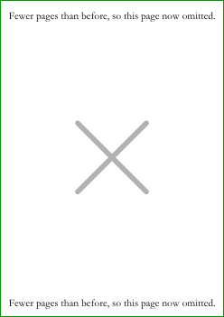

# Document-level controls

**Link to the main program**: [placemat.ps](../PostScript/placemat.ps?raw=1)

**Links to documentation**: 
&#9654;&#xFE0E;&nbsp;[Introduction,&nbsp;and&nbsp;a&nbsp;first&nbsp;placemat](introduction_first_placemat.md#readme)&nbsp; 
&#9654;&#xFE0E;&nbsp;[Fonts&nbsp;and&nbsp;glass&nbsp;decoration](fonts_glasses_decoration.md#readme)&nbsp; 
&#9654;&#xFE0E;&nbsp;[Compound&nbsp;Strings&nbsp;and&nbsp;non&#8209;ASCII&nbsp;characters](compound_strings_characters.md#readme)&nbsp; 
&#9654;&#xFE0E;&nbsp;[Page&#8209;level&nbsp;controls](page_level.md#readme)&nbsp; 
&#9654;&#xFE0E;&nbsp;[Arrangement&nbsp;of&nbsp;glasses&nbsp;on&nbsp;the&nbsp;page](PackingStyles.md#readme)&nbsp; 
&#9654;&#xFE0E;&nbsp;[Non&#8209;Glasses&nbsp;Pages](not_glasses.md#readme)&nbsp; 
&#9655;&#xFE0E;&nbsp;*Document&#8209;level&nbsp;controls*&nbsp; 
&#9654;&#xFE0E;&nbsp;[Type&nbsp;sizes](type_sizes.md#readme)&nbsp; 
&#9654;&#xFE0E;&nbsp;[Translations](translations.md#readme)&nbsp; 
&#9654;&#xFE0E;&nbsp;[Code&nbsp;injection](code_injection.md#readme)&nbsp; 
&#9654;&#xFE0E;&nbsp;[Bitmap&nbsp;images](bitmap_images.md#readme)&nbsp; 
&#9654;&#xFE0E;&nbsp;[Debugging](debugging.md#readme)

----

<div style="clear: both;"></div>

## Introduction

There are some controls that effect most or all of the document. 
* Some affect the printed ouput.
* Some affect non-printable qualities of the PDF. 
* Others are for debugging, or for documentation generation. 

## Printable

### Numbers of copies

Some page types are controlled by Booleans, others by integer numbers of copies.

Integers:
* `GlassesNumCopies`;
* `CorkDisplayNumCopies`;
* `NeckTagsNumCopies`;
* `PrePourNumCopies`;
* `DecanterLabelsNumCopies`;
* `TastingNotePagesNumCopies`;
* `DecantingNotesNumCopies`;
* `AccountsNumCopies`;
* `StickyLabelsNumCopies`;
* `BottleWrapNumCopies`.

Booleans:
* `VoteRecorders`;
* `PlaceNames`;
* `OneCircles`.

Some page types reproduce what is on the glasses pages:  
* pre-pour;  
* neck tags;  
* sticky labels;
* bottle wraps;
* one circle.

It is possible to make these pages without the glasses page by making the glasses pages, and `/GlassesNumCopies 0 def` to not show them. 
This happens automatically for the last two, via `BottleWrapSuppressOtherPageTypes` and `OneCircleSuppressOtherPageTypes`.


### Margins

There is a margin between the left edge of painted ink, and the physical edge of the page. 
These are `MarginL` (left), `MarginR` (right), `MarginB` (bottom), and `MarginT` (top), defaulting to 24pt =&nbsp;&#8531;&Prime; &asymp;&nbsp;8.5mm. 
But if referencing margins within injected code, use `MgnL` etc, as these are appropriately modified when `SideBySideGlassesTastingNotes` is true.

If adding crop marks, it is easiest to add them into white space around the logical page. 
This can be done for just the glasses page (the only page type for which the author has used this), `OuterGlassesMarginL` etc, or around the other page types, `OuterMarginL`, etc. 
There is also the Boolean setting `OuterGlassesCropMarks`.


### Rotate180AlternateNames

At a large tasting there can be three or four glasses pages each, and a similar number of tasting-note pages. 
Setup can be slightly swifter if the boundary between sets of papers is sharper, done by rotating 180&deg; the papers of alternate people. 
For this, `/Rotate180AlternateNames true def`.

### PageOrdering&hellip;

On the day of a multi-session tasting, there is a lot of work: table setup, decanting etc. 
Shuffling several sessions of paper would be needless work: pages can be ordered to match the sessions. 
It simplifies one task. 

* Each page has a value of its PageOrdering. Smaller numbers are printed first. 

* Within each PageOrdering, pages are sorted by the paper size, for ease of handling. 

* Within each PageOrdering and paper size, printing order is:
    - Loop over all the names, printing for each in turn the glasses, then the tasting notes, then the place names;
    - Then print vote recorders, then decanting notes, then accounts, then cork displays, then neck tags, then pre-pours, then the sticky labels. 


The default values are as follows. 

<div align="center">

|           Parameter            |           Same length as            | Default<br>element | Notes |
|:-------------------------------|:------------------------------------|-------------------:|:------|
| `PageOrderingGlasses`          |                    `GlassesOnSheets`|                  1 |       |
| `PageOrderingTastingNotePages` |          `GlassesOnTastingNotePages`|                  1 |       |
| `PageOrderingVoteRecorder`     |    `GlassesClusteredOnVoteRecorders`|                  1 |       |
| `PageOrderingDecantingNotes`   |   `GlassesClusteredOnDecantingNotes`|                  1 |       |
| `PageOrderingAccounts`         |           `PageOrderingVoteRecorder`|                  1 |       |
| `PageOrderingCorkDisplay`      |      `GlassesClusteredOnCorkDisplay`|                  1 |       |
| `PageOrderingNeckTags`         |                    `GlassesOnSheets`|                  1 |       |
| `PageOrderingPrePourPages`     |                    `GlassesOnSheets`|                  1 |       |
| `PageOrderingBottleWrap`       |                    `GlassesOnSheets`|                  1 |       |
| `PageOrderingOneCircle`        |            *Not array; single value*|                  1 |       |
| `PageOrderingPlaceNames`       |                    `NamesPlaceNames`|                100 | Late, for folding. |
| `PageOrderingDecanterLabels`   |                    `GlassesOnSheets`|                200 | Near-last, for cutting and gluing before the tasting day. |
| `PageOrderingStickyLabels`     |                    `GlassesOnSheets`|                300 | Last, for manual change of paper in the printer. |

</div>

For a single-session this default works. 
For a multi-session tasting, it is worth the effort of changing these. 


### MirrorPages&hellip;

If printing a page to the underside of acetate, the page would need to be mirrored. 
For this there are `MirrorPages…` parameters, arrays of Booleans, of the same length as the similarly named `PageOrdering…` parameters. 
(Added to code in September 2009; as of July 2023 never used live &mdash; so if you are going to use this, do so substantially in advance of the tasting in case subtle bugs are revealed.)


### Suppressing pages

Consider making placemats for somebody else. 
Sometimes, a question of style or design for the commissioner might be answerable by inspection of a small number of pages. 
It can be useful to suppress some pages, but in a manner than is easily reversed, and which allows the maker of the placemats to be easily convinced that the reversal has fully happened. 

There are several parameters that allow this. 
* `TestingMaxNumPagesToShow` suppresses pages after this integer. 

* `TestingShowThesePagesOnly`: Either `null`, in which case having no effect; or an array of integers, in which case showing only those.
The `TestingSuppressPageTypes` array can also include `/DistillerLog`, which does not take an integer as it suppresses all log pages.

* `TestingSuppressPageTypes` has been by far the most useful of these controls. 
For most page types, an entry, which is a page type then integer, shows only the first so many of that page type. 
For the log file only, `/DistillerLog`, it has no parameter and suppresses the whole log.
E.g., to show only the first page of each type, and none of the log: 
```PostScript
/TestingSuppressPageTypes [
	/Glasses        1
	/TastingNotes   1
	/VoteRecorder   1
	/DecantingNotes 1
	/Accounts       1
	/CorkDisplay    1
	/NeckTags       1
	/PrePour        1
	/PlaceName      1
	/DecanterLabels 1
	/StickyLabels   1
	/BottleWrap     1
	/OneCircle      1
	/DistillerLog
] def  % /TestingSuppressPageTypes
```

If using these, put them at the very top of the changed parameters, to help not forgetting to undo them. 

Sometimes page suppression can produce one extra blank page, as discussed in [issue 109](http://github.com/jdaw1/placemat/issues/109).

### CMYK black

`/CMYK0001replacesRGB000 true def` replaces RGB black =&nbsp;`0 setgray` with printers&rsquo; CMYK black =&nbsp;`0 0 0 1 setcmykcolor`.


## High-level code insertion

The software allows, perhaps even encourages, [code injection](code_injection.md#readme). 
No, this isn&rsquo;t the modern idiom for software. 
But really, modern software isn&rsquo;t written in PostScript.

* `PrologueCode` is executed just once, just before painting pages, which means after many of the internal variables have been computed. 

* `EpilogueCode` is also executed just once, at the end after painting pages.

* `PaintBackgroundCode` is executed once per page, just before other painting begins. Usually, the painting is to happen only on the glasses pages, for which the code might resemble:
```PostScript
/PaintBackgroundCode 
{
	/Glasses TypeOfPagesBeingRendered eq
	{
		% Useful code, 
		% perhaps referring to PageWidth, PageHeight, MgnL, MgnR, MgnB, MgnT, 
		% perhaps to SheetNum, perhaps to Radii SheetNum get, 
		% perhaps to GlassPositions SheetNum get.
	} if  % /Glasses ...
} bind def  % /PaintBackgroundCode
```
* `PaintForegroundCode` is executed once per page, just after other painting is finished.

* `PaintBackgroundInsideGlassCircles` is called once per circle on the glasses page. Called with centre of circle translated to 0,0; and clipped to a radius of `Radii SheetNum get`.


### An empty page



The empty-page feature is for a fussy rarely-used specialist purpose, and when used is meant to be used temporarily. 

Assume the following. 
You are making placemats for a team tasting. 
A draft is made. 
You upload to your website the current draft of the PDF, and, for use in a  thread, PNGs of the several glasses page. 
Your post with the PNGs is quoted by somebody else. 
People drop out; the number of wines shrinks; the number of glasses pages drops by one. 
The PDF and PNGs are updated, and re-uploaded; the PNG of the former last page is deleted from the server. 

But there is still that quote of your post, that quote attempting to show the now-missing last PNG. 
This might not be liked by the aesthetically sensitive. 

So `/EmptyGlassesPageAtStart true def` adds an &lsquo;empty&rsquo; page to the start. 
Convert to PNG and upload, and then reset to `/EmptyGlassesPageAtStart false def`. 

It uses `EmptyGlassesPageOrientation` and `EmptyPageString`, and re-uses `TastingNotesPaperType` and `HeaderFont`. 


## PDF properties

Some non-printable properties of the PDF can be controlled or affected by parameters.

### PDF_title

PDFs can have a title, embedded within its DocInfo. 
If viewing a PDF in a web browser, the tab will typically show that title, and it is also seen and shown by search engines. 
`PDF_title` holds that string.


## External Links

It might be that in the future somebody finds, somewhere on the web, a copy of the placemat PDF. 
There should be a route home. 
A PDF document can have an &lsquo;outline&rsquo;, usually shown in a sidebar, that summarises the document structure and provides internal navigation. 
The placemat software creates this automatically. 


At the end of the outline are relevant external links, provided in the parameter `ExternalLinks`.

Typically, there are links to relevant forum threads. 
Also links to the restaurant where held, and to its location in various mapping programs. 
Such links, sometimes carefully constructed, should be reused, and those for multiple restaurants are in [ExternalLinks_data.ps](../PostScript/ExternalLinks_data.ps), which also has links to many Port shippers. 
Obviously, use only the relevant subset of the many links in that file. 
And if links are missing or rotted, please post that in [issue&nbsp;157](http://github.com/jdaw1/placemat/issues/157).

`ExternalLinks` is an array of length a multiple of three:  
* Boolean0, Descriptor0, URL0;  
* Boolean1, Descriptor1, URL1;  
* &hellip;.

The first boolean must be `false`; subsequent booleans are `true` if the link is a &lsquo;child&rsquo; of the previous `false` link, and are `false` if a &lsquo;parent&rsquo; link. 
(If the PDF viewer is showing the table of contents there is a small triangle beside the &lsquo;parent&rsquo; link: pointing right if the children are hidden (&ldquo;&#9656;&rdquo;); pointing down if the children are visible (&ldquo;&#9662;&rdquo;); rotated between the two by being clicked on.) 
The descriptions can be compound strings, `[…]`. 
The URLs must be plain simple strings, `(...)`, not arrays nor compound strings, and must start with a protocol such as &ldquo;http://&rdquo;. 


### PageOrdering, sections

PageOrdering sections can be lightly titled. 
If the PageOrdering parameters have split the paperwork into a few sessions, there is a functional elegance in having, within the table of contents, titling. 

The parameter `PageOrderingSections` is an array of even length, alternately page-ordering numbers and compound strings, that adds extra rows to the PDF reader&rsquo;s table of contents. 
The compound strings appear immediately before the page orderings with which they are paired.
[E.g.](http://www.jdawiseman.com/2013/20131011_1963_ahb.pdf):

```PostScript
/PageOrderingSections [
	  0  ()
	  0  [/section ( Friday evening, The Hotel)]
	 10  ()
	 10  [/section ( Saturday afternoon, The Pub)]
	 20  ()
	 20  [/section ( Saturday evening, The Hotel)]
	200  ()
	200  [/section ( Multiple sessions)]
] def  % Array of even length, alternately elements of the PageOrder...s, and compound strings
```


### PagesToBeInserted


Rarely, PDF pages from a different source are to be inserted into the document made from PostScript. 
That mostly works, except that it would mess the page numbering in the Table of Contents. 
This can be repaired, and the inserted pages can have their own ToC entries. 

Start with `/PagesToBeInserted true def`. 
Then there are five arrays of the same length, one of which is an array of arrays. 
Two of these arrays describe where the insertions happen, and two describe the additions to the ToC. 


ToC entries appear before a page of one of the types in the sub-arrays of `PagesToBeInsertedBeforeTypeOneOf`, and before instance number `PagesToBeInsertedBeforeInstances` of a block of such types. 
The double-depth array allows some flexibility by *de facto* merging several types; and instance 0 is the first such block of these types, 1 the second, etc.

If the element of PagesToBeInsertedDests is a name, so beginning with a &ldquo;`/`&rdquo;, there will be a ToC entry pointing to this &lsquo;DEST&rsquo;, titled with the element of `PagesToBeInsertedDescriptions`. 
And the number of pages being inserted is the element of `PagesToBeInsertedNumPages`, which allows the page numbering to be correct. 

So the following makes space for `1` inserted page before the first instance (instance `0`) of any of `/VoteRecorder` `/DecantingNotes` `/Accounts`. That page is to have the internal name, useable as a #&hellip; suffix to a URL, of &ldquo;FoodOrder_0&rdquo;, and is to be visible in the ToC as &ldquo;Food order&rdquo;. 

```PostScript
/PagesToBeInserted                true                                          def
/PagesToBeInsertedNumPages        [ 1 ]                                         def
/PagesToBeInsertedBeforeInstances [ 0 ]                                         def
/PagesToBeInsertedBeforeTypeOneOf [ [/VoteRecorder /DecantingNotes /Accounts] ] def
/PagesToBeInsertedDests           [ /FoodOrder_0 ]                              def
/PagesToBeInsertedDescriptions    [ (Food order) ]                              def
```


### #Linking to specific pages within the PDF

This is a feature of the PDF, but one not controlled by the parameters. 

So that it is possible to link to specific pages within the PDF, the PDF includes some &lsquo;nameddest&rsquo;s. 
However, the use of these is imperfectly reliable. 
It seems to work when opening a PDF within the browser, but if the PDF is read by a separate application, it seems not to work.

To link to the first of the pages of glasses the URL should end `#Glasses_0`. 
For second page, `#Glasses_1`; etc. 
Links for other types of pages are shown in the table. 
The log file also contains a list of the &ldquo;URL # tags&rdquo; added to the PDF.

If `GlassesDestForEachCircle` is true, there are also # tags for individual glass circles, as detailed in the log. 
(But not all PDF viewers correctly zoom to these circles: see bugs [in Apple Preview](http://discussions.apple.com/thread/7234631) and [in Google Chrome](http://bugs.chromium.org/p/chromium/issues/detail?id=535978).) 
Changing `GlassesDestForEachCircle` from false to true increases the file size, in a typical example from &asymp;&nbsp;360k to &asymp;&nbsp;400k, &asymp;&nbsp;11%: not tiny. 
These &lsquo;Dest&rsquo;s are most useful for the placemat maker, speeding the checking of an individual circle&mdash;but there&rsquo;s no need to check the same circle on multiples `Names`, because they are all the same. 
So `GlassesDestForEachCircle`&rsquo;s default value is `{NameNum 0 eq}`, which makes them for only the first of the `Names`.

<div align="center">

| `TypeOfPagesBeingRendered` | URL ending of first<br>page of this type |
|:--------------------------:|-----------------------------------------:|
| `/Glasses`        | `#Glasses_0`        |
| `/TastingNotes`   | `#TastingNotes_0`   |
| `/VoteRecorder`   | `#VoteRecorder_0`   |
| `/DecantingNotes` | `#DecantingNotes_0` |
| `/Accounts`       | `#Accounts_0`       |
| `/CorkDisplay`    | `#CorkDisplay_0`    |
| `/NeckTags`       | `#NeckTags_0`       |
| `/PrePour`        | `#PrePour_0`        |
| `/PlaceName`      | `#PlaceName_0`      |
| `/DecanterLabels` | `#DecanterLabels_0` |
| `/StickyLabels`   | `#StickyLabels_0`   |
| `/BottleWrap`     | `#BottleWrap_0`     |
| `/OneCircle`      | `#OneCircle_0`      |

</div>

### Copyright and LicensingAgreement

The `CopyrightStatementPlacemats`, `LicensingAgreementTextPlacemats`, and `LicensingAgreementLinkPlacemats` are all output to the log. 

It is intended that the latter two, or at least the last, will be embedded in the PDF in a machine-readable searchable filterable manner, per [issue 16](http://github.com/jdaw1/placemat/issues/16). 
(Expert help wanted: be not shy about replying to an issue.)

## Debugging and documentation generation

### Distillation log

Various log outputs are produced by the software. 
Some might help bebugging. 
Others, such as listing fonts used, are to help those using old placemats as inspiration for new. 
The log can go to three places, controlled by three Booleans.
* `OutputLogToLog`: there is no reason not to do this. 
* `OutputLogToPage`: appears at the end, and generally a good idea (except when the pages are to be converted to a GIF animation, or if many copies are to be printed by somebody inattentive). 
* `OutputLogToAnnotation`, a small pop-up text box on the last page of the PDF &mdash; necessary only when `OutputLogToPage` is false. 

`LogThisExtra` contains a string, perhaps a multi-line string, which is output to the log file. 

### PageLabelOverride and PageLabelOverrideWith

`PageLabelOverride` and `PageLabelOverrideWith` are used extremely rarely. 
Indeed, perhaps only for making documentation.

PDFs allow page labels. 
In some PDF viewers the page labels appear beneath the thumbnails in the sidebar. 
They have another purpose: if a PDF has been imported by [Lemke Software&rsquo;s GraphicConverter](http://www.lemkesoft.de/en/products/graphicconverter/), and all the pages are output, the page labels become the file names of the separate bitmap files. 
So if, for example, making [documentation for the `PackingStyles`](PackingStyles.md#readme) function, having the parameters control the page labels would eliminate possible copy-paste errors in the naming of the files. 

The usual page labels are overridden if `PageLabelOverride` is true. 
for example, it might be `def`&rsquo;d to `{/Glasses TypeOfPagesBeingRendered eq}`. 
Then `PageLabelOverrideWith` is a string, or code returning a string, that is the desired page label. 
