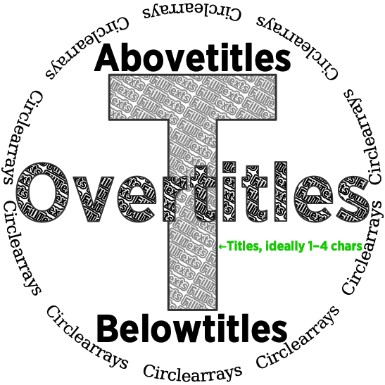
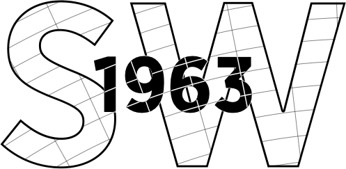
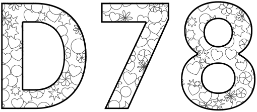
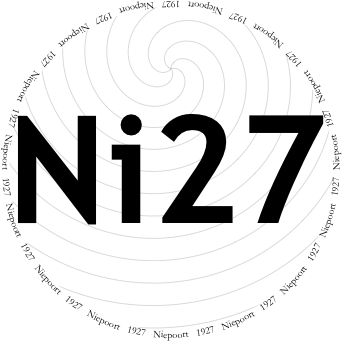

# Fonts and glass decoration

**Documents**: 
1.  [Introduction, and a first placemat](introduction_first_placemat.md);  
2.  [Compound Strings and non-ASCII characters](compound_strings_characters.md);  
3.  *Fonts and glass decoration*;  
4.  [Type sizes](type_sizes.md);  
5.  [Page-level controls](page_level.md);  
6.  [Arrangement of glasses on the page](PackingStyles.md);  
7.  [Non-Glasses Pages](not_glasses.md);  
8.  [Document-level controls](document.md);  
9.  [Code injection](code_injection.md);  
10. [Bitmap images](bitmap_images.md);
11. [Translations](translations.md).

----

## Abovetitles, Overtitles, and FillTexts



The [Introduction](introduction_first_placemat.md) discussed the array parameters `Circlearrays`, `Titles`, and `Belowtitles`.
Also there are analagous parameters `Abovetitles` and `Overtitles`, and text can also be put into `FillTexts`, as shown in the nearby image.

All these arrays must be of the same length. 
If they are not, distillation will output some explanation to the log, and then terminate.

This profusion of places to put information should be used sparsely, and consistently. 
For example, in a vertical, the `Titles` might contain two-digit years, and the `Overtitles` a concise version of the name of the shipper or quinta or winery or ch&acirc;teau or distillery. 
Most `Abovetitles` would be blank =&nbsp;`()`, only a few specifying a non-standard bottle size such as &ldquo;Double Magnum&rdquo;. 
Most `Belowtitles` would be blank, only a few specifying the likes of &ldquo;Cask Sample&rdquo;.

Extracts of code that made the image, for later explanation:
```PostScript
/ColourSchemeTitles /MidGrey def
/FontSizesSetsAboveBelowOver [ 0 0 1 ] def
/InlineTitles false def
/FillTitles true def
/CircletextMaxFontSizeAbsolute 11 def
```


## Colours

In the previous image the `Titles` are grey, but the `Overtitles` and others are black. 
There are four relevant parameters, which can take the values `/MidGrey` or `/Black`.
```PostScript
/ColourSchemeTitles      /MidGrey def
/ColourSchemeAbovetitles /Black   def
/ColourSchemeBelowtitles /Black   def
/ColourSchemeOvertitles  /Black   def
```
## Fonts

The code may access any fonts appropriately installed on the machine doing the PS&nbsp;&rarr;&nbsp;PDF conversion. 
Fonts are accessed by their PostScript name. 
On a Mac, in the application *Font Book*, select a font and its PostScript name is shown. 
It is more difficult on Windows &mdash; a search engine can assist. 
Or distill the file [fonts_illustrated.ps](../code/fonts_illustrated.ps), which makes a document showcasing the available fonts. 

By default fonts are set as follows.
```PostScript
/TitlesFont          /TrebuchetMS-Bold def
/CircletextFont      /Garamond def
/AbovetitlesFont     {TitlesFont} def
/BelowtitlesFont     {AbovetitlesFont} def
/OvertitlesFont      {TitlesFont} def
/NamesFont           {PlaceNames {TitlesFont} {CircletextFont} ifelse} bind def
/SubtitlesFont       {OvertitlesFont} def
/FillTextFont        {TitlesFont} def

/PlaceNamesFont      {NamesFont} def
/BackgroundTextsFont {TitlesFont} def

/HeaderFont          {CircletextFont} def
/FooterFont          {HeaderFont} def
```
It is mostly self-explanatory, even though the reader will not have been introduced to where all these are used. 
Two font parameters are set to particular fonts, the other font parameters copying them. 

Other good fonts to use include: 
`/Didot` and `/Didot-Bold` (the bold being a slightly decorative but stylish choice for the titles of a vertical which are hence digits); 
`/Cochin` and `/Cochin-Bold` (Port-style titles of the form &lsquo;T70&rsquo; being particularly fine); 
`/Harrington` (mischievously over-ornate); 
various weights of `/Gotham`, being a sans-serif font with a hint of drama; and
`/TimesNewRomanPS-BoldMT`, which has glyphs for effectively all the accent-letter combinations; 
and many others. 

There is another fussiness in this default. 
Mostly, the curly brackets are unnceccessary. 
Mostly, `/OvertitlesFont TitlesFont def` would work as well as `/OvertitlesFont {TitlesFont} def`. 
The former sets `OvertitlesFont` to a value. 
The latter sets `OvertitlesFont` to code, which is later executed. 
If `TitlesFont` were itself code, such that its output depended on an internal variable such as `WithinTitles`, the latter would be necessary. 
And indeed, `NamesFont` is set to a little code, that is executed each time `NamesFont` is needed. 
(The `bind` is a slight optimisation, which could have been omitted.)

As of the third millennium, most programming environments frown on code injection. 
But in this PostScrpt program code injection is allowed, often encouraged, and occasionally necessary. 
Those not comfortable with that may safely leave such parameters at their default values. 

## CrossHatching



The SW63 example shows the check pattern CrossHatching, with `InlineTitles` also `true`. 
There are multiple places this feature can go. 
* Within the Titles, Abovetitles, Belowtitles, or Overtitles (as in the example image). 
* *Inside* the circle, but behind the large text pieces. 
* In the &lsquo;unused&rsquo; space *Outside* the circles, i.e., between the circles. 
Some parameters are consistent across these, so that they align, some differ. 

Again, these possibilities are enabled by some Booleans. 

```PostScript
/CrossHatchingOutside false def
/CrossHatchingInside false def
/CrossHatchingTitles false def
/CrossHatchingAbovetitles {CrossHatchingTitles} def
/CrossHatchingBelowtitles {CrossHatchingTitles} def
/CrossHatchingOvertitles {CrossHatchingTitles} def
/CrossHatchingPlaceNames {CrossHatchingTitles} def
```

The polar gridlines originate from a point with *x* coordinate `CrossHatchingCentreX`, which can take values of `/Name`, `/Left`, `/Center`, `/Right`, or a number being points from the left edge of the page. 
At a big tasting there can be multiple sheets of glasses, and it&rsquo;s more elegant to have the pattern consisent across pages. 
For which `CrossHatchingCentreX` can be `/CenterSheetsSamePageOrdering`: if each person&rsquo;s glasses sheets for this session are in a single row, all the circles and lines originate from the common *x*-centre. 
The *y* coordinate `CrossHatchingCentreY` has possible values `/Name`, `/Bottom`, `/Middle`, `/Top`, or points from the bottom of the page. 

This structure is typical of many of the parameters: the user can choose a value; or can access some pre-written logic by name.

There is another sense in which `CrossHatching` is typical of many features. 
There are a few essential controls. 
And there are many other controls which can almost always remain at their default values, but which may be changed by a fussy user. 
In parts of this documentation such parameters are headed &ldquo;superfluous&rdquo;.

### Superfluous

The number of straight lines is `CrossHatchingNumRadialLines`, defaulting to 180 so 2&deg; apart. 
The radii are chosen such that each cell has area `CrossHatchingCellArea`, defaulting to &asymp;491&nbsp;pt&sup2; &asymp; (7.8mm)&sup2;.

`CrossHatchingOutsideToPaperEdge` is a Boolean affecting the &lsquo;Outside&rsquo; lines: to paper edge, or to the internal margin? 

Lines are formatted and stroked by the code in `CrossHatchingTitlesStrokeCode`. 
The code must include the `stroke`, this requirement permitting the likes of `gsave 0 setgray 2.4 setlinewidth stroke grestore 1 setgray 0.96 setlinewidth stroke`. 
And analogous `stroke`ing code `CrossHatchingAbovetitlesStrokeCode`, `CrossHatchingBelowtitlesStrokeCode`, and `CrossHatchingOvertitlesStrokeCode`, `CrossHatchingInsideStrokeCode`, `CrossHatchingOutsideStrokeCode` (`CrossHatchingPlaceNames` uses the sub-parameters of CrossHatchingTitles). 
Sometimes used with `CrossHatchingInside` and `CrossHatchingOutside` is `CirclearraysFillBehind`, which fills behind the annulus containing the `Circlearrays` by executing `CirclearraysFillBehindCode`.

The Inside lines (inside the circle but behind the various titles) are less elegant on some ther page types. 
Their presence is controlled by `NeckTagsShowCrossHatchingInside` and `DecanterLabelsShowCrossHatchingInside`.

Extracts of code that made the image:
```PostScript
/CrossHatchingTitles true def
/CrossHatchingTitlesStrokeCode     {0 setgray 0.24 setlinewidth stroke} def
/CrossHatchingOvertitlesStrokeCode {1 setgray 0.72 setlinewidth stroke} def
/InlineTitles true def
/ColourSchemeTitles /Black def
```

## Shapes: stars and flowers and hearts



In the image showing [QvA08](http://www.jdawiseman.com/papers/port_and_wine/quevedo_2008.html), the Titles and Belowtitles contain small random stars and flowers, with `InlineTitlesMaxNumberContours` at 2. 

These are enabled by Booleans `ShapesInTitles`, with obvious variations `ShapesInAbovetitles`, `ShapesInBelowtitles`, `ShapesInOvertitles`, and `ShapesInPlaceNames`. 
The array `ShapesToUse` defaults to `[/Flower /Star /Heart]`, and must contain at least one of these.

Each shape is filled with the code `ShapesTitlesFill` (or `ShapesAbovetitlesFill`, `ShapesBelowtitlesFill`, `ShapesOvertitlesFill`), which, if the shapes are `fill`ed, should end with a `fill`. 
After which `ShapesTitlesStroke` (or `ShapesAbovetitlesStroke`, `ShapesBelowtitlesStroke`, `ShapesOvertitlesStroke`) which should end with a `stroke`.
The internal variables `ShapesIntX` and `ShapesIntY` hold that shape&rsquo;s position within the whole; these can be accessed by the painting-code parameters to choose from amongst a set of colourings. 

The radius of each shapes&rsquo;s enclosing circle is random in the range `ShapesEnclosingCircleRadiusMin` to `ShapesEnclosingCircleRadiusMax`. 
An approximation to the typical separation between the shapes is `ShapesAverageSeparation`; a parameter controlling how far stars are moved from a regular grid is `ShapesAverageMaxTweakPlusMinus`. 
The pattern generates some shapes that are not shown, that are clipped away: if `ShapesPrintQuickerDistillSlower` is `true` these are removed, reducing file size and improving print speed at the price of slowing distillation.

Sometimes, albeit rarely, this `clip`ping is not wanted. 
For instance, if the stars are filled white with no border, the clipping achieves no good. 
Not only no good, but there can be a tiny bleed between the underlying letter&rsquo;s fill and the clipped shape, such that a very thin black border remains. 
Or this non-`clip`ping might be wanted for visual effect. 
Whatever the reason, controlled with the Boolean parameters `ShapesTitlesClip`, `ShapesAbovetitlesClip`, `ShapesBelowtitlesClip`, `ShapesOvertitlesClip`, `ShapesPlaceNamesClip`, for which true means do clip.

Some parameters affect just one of the possible values of `ShapesToUse`.

For the stars, the numbers of points and the step between points are chosen randomly from within `ShapesStarsPointsAndStepsArray`, the default being `[[5 2] [6 2] [7 2] [7 3] [8 3]]`. 
A possible alternative value for ShapesStarsPointsAndStepsArray is `[[3 1.318] [4 1.792] [5 2.278] [6 2.77]]`, being pointier and less polygonal. 

For the flowers the number of petals is chosen randomly from `ShapesFlowersNumPetalsMin` to `ShapesFlowersNumPetalsMax`, and, as a proportion of 360&deg; divided by the number of petals, the angular width of each is chosen randomly from the range `ShapesFlowersAngularWidthMin` to `ShapesFlowersAngularWidthMax`.

Extracts of code that made the image for the Dow &rsquo;78:
```PostScript
/ColourSchemeTitles /Black def
/InlineTitles true def
/InlineTitlesMaxNumberContours 3 def
/ShapesInTitles true def
```

## Spirals



Another playful decoration, a background spiral, is engaged by the Boolean `Spirals`. 
The number of arms is `SpiralNumArms`, and the whole pattern can be rotated by `SpiralAngleOffset`. 
The radius betweem arms, measured to the centre rather than perpendicular to the direction of travel, is `SpiralRadiusBetweenArms`. 
The meaning of the Boolean `SpiralClockwise` is obvious. 

`SpiralStrokeCode`, by default a boring `{stroke}`, can hold formatting of the line (e.g., `{gsave 0.6 setgray 1.44 setlinewidth stroke grestore 1 setgray 0.48 setlinewidth stroke}`). 

The centre of the spiral does not have to be the centre of the circle, as controlled by `SpiralCentreFromCentreAngle` and by `SpiralCentreFromCentreProportionRadiiInside`. 

Extracts of code that made the image:
```PostScript
/InlineTitles false def
/Spirals true def
/SpiralNumArms 5 def
/SpiralCentreFromCentreProportionRadiiInside 0.618 def
```

## OutlineTitles


This is a decorative possibility that has existed since early versions of this code. 
But I now see it as too cluttered so am less fond of it than when it first appeared: &#655;&#7437;&#7437;&#7456;.

It is engaged with the Boolean `OutlineTitles`. 
If that is, then also heeded are `OutlineTitlesAlsoAbovetitles`, `OutlineTitlesAlsoBelowtitles`, and `OutlineTitlesAlsoOvertitles`.

The innermost white is of width `OutlineTitlesInnerWidthWhite`, and the innermost black of width `OutlineTitlesInnerWidthBlack`. 
These grow in successive outlines by factors of `OutlineTitlesMultiplierWhite` (defaulting to &frac12;(1&nbsp;+&nbsp;&radic;5) =&nbsp;the golden ratio &asymp;&nbsp;1.618) and `OutlineTitlesMultiplierBlack` (defaulting to 1, so all the black outlines have the same width). 

The number of black ripples is capped at `OutlineTitlesMaxNum`. 
The code attempts to stop sooner, but a good user constraint can only help, especialy if either multiplier is &lt;1. 

OutlineTitles does not impose as high a burden on a printer as does FillTexts, but can still be difficult for some. Again, test your printer.

Analagous to the cross hatching parameters are `NeckTagsShowOutlineTitles` and `DecanterLabelsShowOutlineTitles`. 

Extracts of code that made the image:
```PostScript
/ColourSchemeTitles /MidGrey def
/RotationTitlesAboveBelowOverCirclearray 30 def
/InlineTitles false def
/OutlineTitles true def
```

## Rotation

The numeric parameter `RotationTitlesAboveBelowOverCirclearray` rotates the whole circle by that many degrees, in the QvA08  example by `30`. 


## InlineTitles

This decoration is engaged by default, the relevant Booleans being `InlineTitles`, `InlineAbovetitles`, `InlineBelowtitles`, `InlineOvertitles`, and `InlinePlaceNames`. 

How many steps in should it go? 
This is capped at `InlineTitlesMaxNumberContours`, `InlineAbovetitlesMaxNumberContours`, `InlineBelowtitlesMaxNumberContours`, and `InlineOvertitlesMaxNumberContours`. 
(InlinePlaceNames uses the sub-parameters of InlineTitles.)
By default his cap is an elegantly sparse `1`; the Dow&nbsp;&rsquo;78 example shows it at `3`. 

In the Titles the lines have widths of `InlineTitlesBlackWidth` and `InlineTitlesWhiteWidth`; with obvious variations `InlineAbovetitlesBlackWidth`, `InlineAbovetitlesWhiteWidth`, `InlineBelowtitlesBlackWidth`, `InlineBelowtitlesWhiteWidth`, `InlineOvertitlesBlackWidth` and `InlineOvertitlesWhiteWidth`. 
If the colour scheme is /MidGrey then &ldquo;black&rdquo; means the darker of the two shades, and &ldquo;white&rdquo; the lighter.

If the capped number of contours is large, then it becomes relevant that the code can attempt an estimate of how many contours are needed. 
It does so if `InlineTitlesAttemptMinimiseNumContours` (or `InlineAboveBelowOverAttemptMinimiseNumContours` or `InlinePlaceNamesAttemptMinimiseNumContours`) is `true`. 
If the code&rsquo;s estimate is too low, as might happen if the lines are very thin, then the booleans should be false and the upper bounds set carefully. The attempted estimate is computed using a horrible algorithm, &lsquo;discussed&rsquo; at [comp.lang.postscript](https://groups.google.com/forum/#!topic/comp.lang.postscript/86b7Sg8v7B0). 

If `InlinePrefillWhite`, all of the Titles/Abovetitles/Belowtitles/Overtitles are filled white before painting the &lsquo;Inlines&rsquo;, so are opaque. 
This is good if there is CrossHatchingInside, but less good with BackgroundTextsGlasses.


## FillTexts

The `FillTexts`, shown in the top image, were enabled by
```PostScript
/FillTitles true def
```
The example shown also has `/FillTextAngle -30 def`, but this does not have to be numeric. 
It also accepts some name values: `/LowerLeft`, `/LowerRight`, `/MiddleLeft`, `/UpperCenter`, `/UpperRight`, or `/Name`, the text being perpendicular to a line from from the value of  `FillTextAngle` to the centre of the circle. 
Using one of these values, my favourite pehaps being `/Name`, causes each circle to have a different angle, but the pattern as a whole coheres aesthetically. 

The Booleans `FillTitles`, `FillAbovetitles`, `FillBelowtitles`, `FillOvertitles`, and `FillPlaceNames` control whether their respective elements are filled with multiple copies of some text, outlined. 
The filling texts are in the array `FillTexts`, which is of the same length as `Titles`, and each is outlined `FillTextNumOutlines` times. 
Depending on the values of `ColourSchemeTitles` etc, the colours are either black and white, or 40% grey and white. 
Each rendering of an item of `FillTexts` is suffixed with `FillTextNumSpaces` spaces.

The `FillTexts` are set in the font `FillTextFont`, at a size of at least `FillTextMinFontSizeAbsolute`, and of a size of at least `FillTextMinFontSizeProportionLargestTitleAboveBelowOver` &times; the largest their font sizes.

The formatting of the `PlaceNames` generally matches that of the Titles, except that the filling text is `FillTextPlaceNames`, and the angle is `FillTextAnglePlaceNames`

### Problems with FillTexts

`FillTexts` makes complicated painting paths inside complicated clipping paths. 
This can cause difficulties for some software; this can cause difficulties for some printers.

Use of `FillTexts` makes distillation slow, and produces files that can be too complicated for some printers. 
The balance between these two can be influenced by the Boolean `FillTextPrintQuickerDistillSlower`. 
For example, in a draft placemat with `FillTitles` and `PlaceNames`, changing `FillTextPrintQuickerDistillSlower` from `false` to `true` decreased the file size from 1013k to 871k, but increased the distill time from 64 seconds to 40 minutes. 
If distilling the PostScript via the web the latter would definitely have timed out the browser. 
And it might be that, on some printers, the print-slowly option (`false`) won&rsquo;t print at all, whereas the print-quickly option (`true`) will. 
But some printers can&rsquo;t cope with either; or the resolution is insufficient for the small grey text to look entirely satisfactory. 
So test your printer; do not assume that anything will work first time; and do not assume that all larger more expensive printers cope better.

It also appears that some versions of Adobe Distiller do not always distill or render perfectly these `FillTexts`. This problem can be fixed by opening the PostScript file with Preview on the Mac OS X, and then printing from Preview or saving the PDF file Preview makes and subsequently printing from Acrobat ([technical demonstration of error](http://groups.google.com/group/comp.lang.postscript/browse_frm/thread/d939df0dde60335c)).

But there is also a problem with Preview on the Mac OS X, which crashes if the paths are too complicated. 
The relevant constraint is on the complexity of the path of the item of FillTexts, plus the complexity of the path of the text that is filled (the item of `Titles` or of `Names`, as appropriate). 
As `Names` are typically longer than `Titles`, the problem can typically be remedied by setting `FillPlaceNames` to `false`.


## GlassesCirclesFadingFactor and GlassesCrossedOut

A few wines are not being drunk by a few people. 
Perhaps they don&rsquo;t like wine of that type; perhaps allergic; perhaps something else. 
It helps with set-up if these exclusions are plainly marked. 
This can be done by fading those circles for those people, or by crossing them out, or both. 

Hence the rarely used `GlassesCrossedOut`, a Boolean; and `GlassesCirclesFadingFactor`, a number &ge;0 and &le;1, in which 0 means entirely faded away and 1 is the black-is-black default. 
The selection of &ldquo;those circles for those people&rdquo; is done with code, by accessing the internal variables `NameNum` and `WithinPage`.
E.g.:
```PostScript
/GlassesCirclesFadingFactor
{
	(Julian) Names NameNum get eq  WithinPage 0 eq  and {0.125} {1} ifelse
} def
```

## GlassesPageWhiteCirclesBehind and CirclearraysFillBehind

Sometimes part of the output is converted to a bitmap, for inclusion in a web page or a phpBB post. 
If the bitmap is to have transparency, it might be that a white background is wanted behind each of the circles. 
The Boolean `GlassesPageWhiteCirclesBehind` does what it says.

There can also be paint behind the Circlearrays, activated by the Boolean `CirclearraysFillBehind`. 
The painting is done with `CirclearraysFillBehindCode`.

## GlassesAnnotations

Placemats have been made and printed and used. 
During the tasting, an error is noticed. 
Ouch! 
There are two obvious *desiderata*. 
As the printed PDF is part of the record of the evening, it should not be changed. 
But also it would be unhelpful to allow the errors to confuse future generations. 
(But see [discussion](http://www.theportforum.com/viewtopic.php?p=90575#p90575) and [more discussion](http://www.theportforum.com/viewtopic.php?p=92316#p92316).) 
E.g., the author has attended a tasting at which the cork of a purported Smith Woodhouse 1963 showed the vintage to be 196**6**.

A non-printable annotation can be added to the PDF. 
`GlassesAnnotations` is an array of even length, alternating `WithinTitles`-style integers pointing into the arrays such as `Titles`, and compound-string annotations.
Be helpful to future historians: each anotation&rsquo;s text should include the date that the correction was added.
