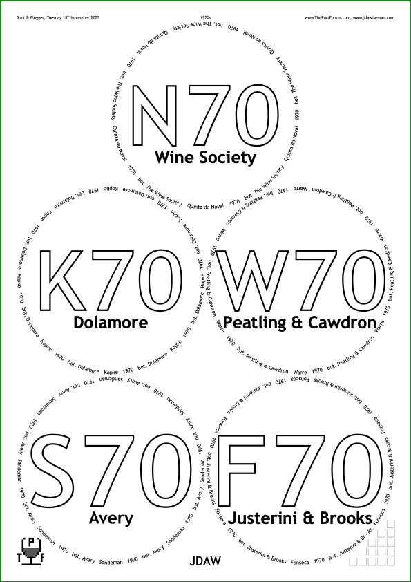

# Introduction, and a first placemat

**Link to the main program**: [placemat.ps](../PostScript/placemat.ps?raw=1)

**Links to documentation**: 
▷︎ *Introduction, and a first placemat*  
▶︎ [Fonts and glass decoration](fonts_glasses_decoration.md#readme)  
▶︎ [Compound Strings and non‑ASCII characters](compound_strings_characters.md#readme)  
▶︎ [Page‑level controls](page_level.md#readme)  
▶︎ [Arrangement of glasses on the page](PackingStyles.md#readme)  
▶︎ [Non‑Glasses Pages](not_glasses.md#readme)  
▶︎ [Document‑level controls](document.md#readme)  
▶︎ [Type sizes](type_sizes.md#readme)  
▶︎ [Translations](translations.md#readme)  
▶︎ [Code injection](code_injection.md#readme)  
▶︎ [Bitmap images](bitmap_images.md#readme)  
▶︎ [Debugging](debugging.md#readme)

----

You and your lucky guests are to enjoy a tasting of a fine beverage — perhaps Port, perhaps whisky, perhaps something else. 
Of course, there will be many glasses, each person having one for each drink to taste. 
It is important to avoid confusion about what is in each glass. 
Hence labelling is needed, best done with beautiful printed pages on which glasses can sit. 
And having done that, there might also be need for matching pages:  
* on which to write tasting notes,  
* to label decanters and bottles,  
* to organise pre-pouring,  
* to display the corks,  
* to label each person’s place-setting (so everybody knows who everybody else is),  
* to record votes for the WOTN = **W**ine **O**f **T**he **N**ight, and  
* to assist with computing the split of the costs, allowing for bottles provided.

This PostScript program creates all the paperwork useful for managing such tastings, large or small. 
Lots of examples from previous tastings are at [jdawiseman.com/placemats_list.html](http://www.jdawiseman.com/placemats_list.html) (lots: that page has ≥ 23 MB of PNGs, so WiFi rather than mobile data).

[The program](../PostScript/placemat.ps) does not hide its being written wholly in PostScript ([wikipedia](http://en.wikipedia.org/wiki/PostScript), [Adobe ᴘʟʀᴍ](https://www.adobe.com/jp/print/postscript/pdfs/PLRM.pdf)). 
The program consists of a single long text file, with user-chosen parameters defined at the top, underneath which are many lines of code to make the pages. 
Those user-chosen parameters are written in Postscript, in PostScript syntax, optionally with embedded PostScript code.

Nonetheless, placemats can be and have been made by those with no programming expertise. 
You can too.

## First placemat: advice for beginners

### A week in advance

Don’t try to make your first placemats with little time to spare. 
Start at least a week in advance, to allow time for learning and improvements, and to avoid the other things that need doing just before a tasting. 
Yes, it can be done quickly — but not your first placemats.

### Editing a file

You will be directly editing a long text file written in PostScript. 
A code editor, a good text editor, is a boon, and it should be one that understands PostScript. 
The basic text editor that came pre-installed on your computer will make life harder than it needs to be. 
A code editor that understands PostScript will prevent many errors and save much labour. 
On both Mac and PC [Sublime Text](http://www.sublimetext.com/) is my preferred editor, though making Sublime understand PostScript requires a small technical step ([source](http://www.sublimetext.com/forum/viewtopic.php?t=17312&start=11)): 
Sublime > **View** menu > fifth item of which is **Show Console** > into which paste 
```
import shutil;import urllib.request;import os;import tempfile;l='https://raw.githubusercontent.com/textmate/postscript.tmbundle/master/Syntaxes/Postscript.tmLanguage';d=urllib.request.urlopen(l);f=d.read().decode('utf-8');p=os.path.join(sublime.packages_path(),'User','PostScript.tmLanguage');_, t = tempfile.mkstemp(dir=tempfile.gettempdir());th = open(t, 'w');th.writelines(f);th.close();shutil.move(t, p) if f.find('plist') != -1 else sublime.error_dialog('Something went wrong, file is corrupt');dh = open(p);ok = True if dh.read().find("Postscript") != "-1" else False;sublime.message_dialog('Installation completted successfully') if ok is True else sublime.error_dialog('Installation aborted - deleting file %s ' % p);os.remove(p) if not ok else print("File created successfully");
```

Also good on Windows is [Notepad++](https://notepad-plus-plus.org/).


### Download the .ps file

Bookmark this manual, and download to your machine a copy of [the PostScript code](../PostScript/placemat.ps?raw=1) (update this copy every time: new versions fix bugs; add features; improve default settings). 
Store it in a directory named something like “placemats”. 
Give the PostScript file a name which will make sense in aeons to come, perhaps YYYYMMDD.ps, or YYYYMMDD_TastingName.ps, as if it will become the first item in your placemat archive.

### Converting the .ps to PDF

You have saved a .ps file. 
This file is to be opened in two different ways: with the code editor; and with a program to convert it from .ps to .pdf. 
Let’s master the latter. 
There are several possible means by which the PostScriptcan be ‘distilled’ into a PDF. 
* On a Mac right-click the file, and ‘Open With’ Preview: it should convert to a PDF. 
* On a PC, in your preferred web browser, open [online2pdf.com/convert-ps-to-pdf](http://online2pdf.com/convert-ps-to-pdf) (or, with fewer fonts available, [ps2pdf.org](http://www.ps2pdf.org/convert.htm) (and perhaps also [ps2pdf.com](http://www.xconvert.com/convert-ps-to-pdf)); ‘Select files…’; and ‘Convert’ it. 
* On Unix use `ps2pdf` which comes as part of [GhostScript](http://en.wikipedia.org/wiki/Ghostscript).

If it that has made a PDF resembling [this](images/placemat.pdf), then you can successfully convert the PostScript to PDF: hurray! 


<div align="center">



</div>

### Titles, Belowtitles, and Circlearrays

Open the file with the code editor, perhaps by right-clicking and choosing from the &lsquo;Open With&hellip;&rsquo; applications (Sublime Text, NotePad++, whatever). 
For a sense of which of the many features might be wanted look at the [list of old placemats](http://www.jdawiseman.com/placemats_list.html), some of which have helpful comments and advice.

Time to do some work. 
The code has parameters already in place, for a Port tasting, alas fictitious. 
The pre-existing values are to be changed to those for your tasting. 

The `Titles` appear in the centre of the circles, in a large font size. 
The `Titles` should be short, ideally 2 or 3 characters, certainly &le;5 characters. 
In the initial state of the code, assuming synchronised documentation, they are defined as:
```PostScript
/Titles [
	(N70)
	(K70)
	(W70)
	(S70)
	(F70)
] def
```
This `def`ines `Titles` to be an array, so delimited with square brackets, `[…]`. 
Each of the items of the array &mdash; this configuration having five &mdash; is a string, so delimited with round brackets, `(string)`. 
Between these strings there can be arbitrary white space: spaces, tabs, newlines. 
Change the `Titles` to match your tasting. 
If there are more than six wines, the number of pages will grow commensurately.

In each circle, below the `Titles`, are the `Belowtitles`. 
This is also an array, which must be the same length as `Titles`. 
```PostScript
/Belowtitles [
	(Wine Society)
	(Dolamore)
	(Peatling & Cawdron)
	[(A) {-0.04 Kern} (very)]
	(Justerini & Brooks)
] def
```
The fourth item of `Belowtitles` is more complicated than a plain string. 
This generalisation of the string type is explained in [Compound Strings and non-ASCII characters](compound_strings_characters.md#readme). 
For a first placemat perhaps restrict yourself to plain ASCII strings.

Again, change these to suit your tasting. 
The example has the `Belowtitles` as names of bottlers, but for your event they might be bottle sizes, or lot numbers, or something else. 
Indeed, it might well be that all five are set to an empty string:  
```PostScript
/Belowtitles [ () () () () () ] def
```
The next essential parameter is `Circlearrays`, which is an array of arrays. 
Each of these arrays is evenly spaced around the perimeter of each glass&rsquo;s circle. 
```PostScript
/Circlearrays [
	[ (Quinta do Noval)          (1970)   (bot. The Wine Society) ]
	[ (Kopke)                    (1970)   (bot. Dolamore) ]
	[ [(W) {-0.07 Kern} (arre)]  (1970)   (bot. Peatling & Cawdron) ]
	[ (Sandeman)                 (1970)  [(bot. A) {-0.06 Kern} (very)] ]
	[ (Fonseca)                  (1970)   (bot. Justerini & Brooks) ]
] def
```
`Circlearrays` must be the same length as `Titles`, but its sub-arrays can be of different lengths. 

Each person&rsquo;s paperwork is named, and `Names` also appear on some of [the other page types](not_glasses.md#readme), such as the vote recorders. 
`Names` is an array, not necessarily of the same length as the previous three. 
```PostScript
/Names [ (Julian)  (Alice)  (Ben)  (Caroline)  (Derek)  (Elizabeth)  () ] def
```

Including a blank name, `()`, is very strongly recommended: last-minute changes to the guest list do happen.

### Good practice

Before changing more parameters, set a good habit. 
There is a comment line (comments begin with a &lsquo;`%`&rsquo;). 
```PostScript
% Recommendation: move changed parameters to just above this line.
```
By cut-and-paste move the changed parameters to above that line. 
And then move and update `ParametersVersionDateTimeAdobeFormat`, which is the time-stamp of the changing of the parameters in the form D:YYYYMMDDhhmm. 

### More settings

Those in North America might wish to change `PaperType` and `TastingNotesPaperType` from `/A4` to `/USL`&nbsp;= US&nbsp;Letter&nbsp;= 8&frac12;&Prime;&times;11&Prime;. 
Observe that these parameters have a value that is a PostScript name, so beginning with a `/`. 
(If using a large `PaperType`, such as `/A3`, and so transporting printouts rolled, do reverse-roll, print on outside, such that when loaded with glasses the page is held flat. Non-reverse-roll, print on inside, means that corners curl upwards: not recommended.)

Pages can have a header. 
The three parameters [`HeadersLeft`](page_level.md#headers-and-footers), `HeadersCenter`, and `HeadersRight`are each an array of even length, alternately number and string. 
For the moment keep the number zero or negative, and update the string. 
E.g.:

```PostScript
/HeadersLeft [
	0
	(Dddday DD Mmmm 20YY)
] def  % /HeadersLeft
/HeadersCenter [
	0
	(Horizontal of 1970s)
] def  % /HeadersCenter
/HeadersRight [
	0
	[(Rick) /quoteright (s Caf) /eacute ( Am) /eacute (ricain)]
] def  % /HeadersRight
```

If it isn&rsquo;t a [ThePortForum](http://www.theportforum.com/viewforum.php?f=3) event, remove the ThePortForum logos&nbsp;(&nbsp;) by setting [`ThePortForumIconPlacement`](page_level.md#the-port-forum-icon-the-port-forum-icon-the-port-forum-icon) and `ThePortForumIconTastingNotePlacement` to `/None` (again, a name-type parameter).

One more parameter. 
Some PDF viewers can show a sidebar, typically containing bookmarks to places within the document. This can also contain external links, typically to the likes of: the thread in which the tasting was arranged; the latest version of the PDF file; websites of winemaker and restaurant; etc. 
These are configured in the array [`ExternalLinks`](document.md#external-links), which is of length a multiple of three: Boolean (*pro tem*, set all to `false`), then text description, then URL (e.g., `http://www.jdawiseman.com/`); then the next Boolean/description/URL; etc. 
Populate `ExternalLinks`.

### Output

Convert to PDF. 
Check carefully for errors that might have furtively appeared, and fix those found, reconverting to PDF as neccessary. 

This should be an elegant functional set of placemats. 

If the tasting is being arranged via a wine bulletin board, upload the PDF to the web, and post in an appropriate thread a link labelled something like &ldquo;Current draft of the placemats&rdquo;. 
Allow some time for comments and corrections and changes. Update as appropriate.

Print. 
(Use toner not ink as wet causes ink to smudge. 
It has been reported that, on a Xerox or HP printer, the mats don&rsquo;t print properly with the &ldquo;Save ink/toner&ldquo; option. 
Y&#7437;&#7437;&#7456;.)

Enjoy the tasting. 

### Many parameters

There are hundreds more parameters, which: 
* [choose fonts](fonts_glasses_decoration.md#fonts) and constrain [their sizes](type_sizes.md#readme);
* [control the placement of the glass circles](PackingStyles.md#readme); 
* [decorate](fonts_glasses_decoration.md#readme);
* enable and control [non-glass page types](not_glasses.md#readme); 
* [organise the document](document.md#pageordering), useful for tastings over several sessions; 
* embed [&copy;&nbsp;copyright information](document.md#copyright-and-licensingagreement); 
* are [code to be executed at specified times](code_injection.md#readme) (code injection being explicitly allowed); 
* do other things, whether between these categories or wholly outside them.

But for a non-huge tasting in a single-session, the above allows much of what is wanted.
