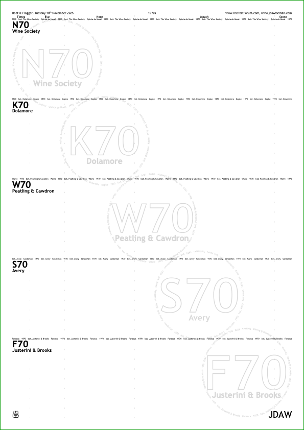
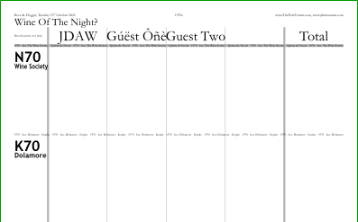
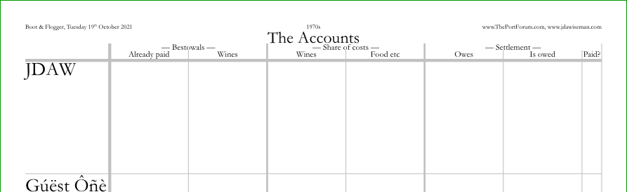
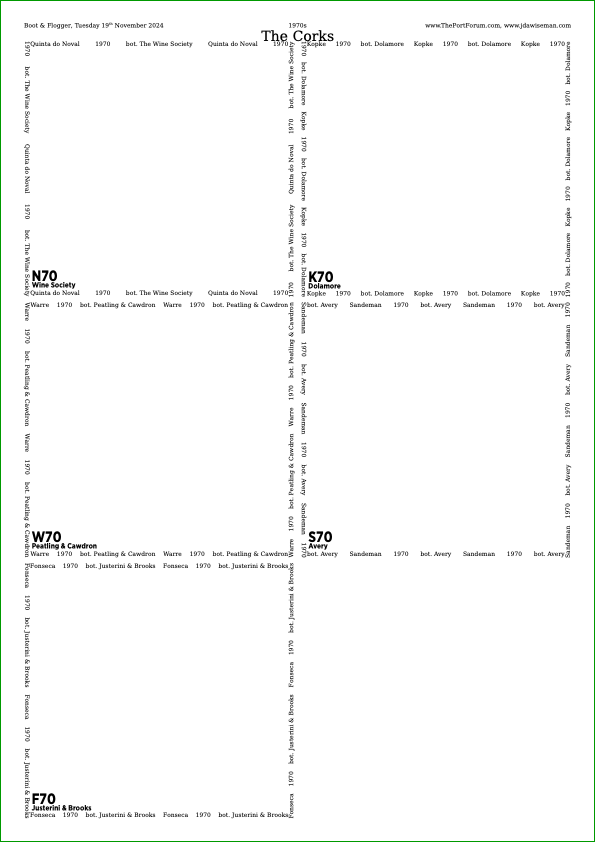
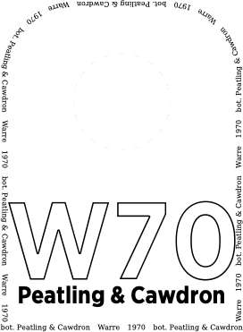
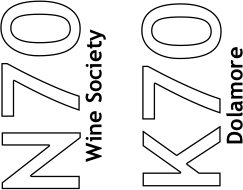

# Non-Glasses Pages

**Documents**: 
1.  [Introduction, and a first placemat](introduction_first_placemat.md);  
2.  [Compound Strings and non-ASCII characters](compound_strings_characters.md);  
3.  [Fonts and glass decoration](fonts_glasses_decoration.md);  
4.  [Type sizes](type_sizes.md);  
5.  [Page-level controls](page_level.md);  
6.  [Arrangement of glasses on the page](PackingStyles.md);  
7.  *Non-Glasses Pages*;  
8.  [Document-level controls](document.md);  
9.  [Code injection](code_injection.md);  
10. [Bitmap images](bitmap_images.md).

----

<div style="clear: both;"></div>

## Introduction

There are multiple types of printable page. 
* `/Glasses`: labels glass positions;
* `/TastingNotes`: for those who record TNs with a pen on paper. 
* `/PlaceName`: At a large formal tasting it is appropriate to label each person&rsquo;s place-setting, so everybody knows who everybody else is, even late in the tasting.
* `/PrePour`: to help with the pre-opouring of portion s necessary at at tastings with many people. 
* `/VoteRecorder`: to record the votes for Wine Of The Night, and to record guesses of blinded wines.
* `/DecantingNotes`: observations of those doing the decanting.
* `/Accounts`: organises the tawdry financial matters. 
* `/CorkDisplay`: as named.
* `/NeckTags`: used at blind tastings around the neck of a wrapped bottle; also helpful when decanting to label de-capsuled bottles. 
* `/DecanterLabels`: cut; paste to back of old business cards; allow to dry; punch holes; hang on decanters; fill decanters; wait; drink.
* `/StickyLabels`: at a tasting with more wines than glasses, these can be attached tot he foot of a glass to show both owner and current contents. Larger stickies also useful on bottles.

To make the glasses pages required information about wines, about people, and about formatting. 
That information is reused to make the other pages.

Each of the non-glasses pages has a few controls, but only a few, described below.


<div style="clear: both;"></div>

## TastingNotes



By default there are also tasting-note pages. 
These have a few parameters which might want changing, and others which are almost never changed. 

### Worthwhile

Page size is `TastingNotesPaperType`, which North Americans should change from the default of `/A4` to `/USL`&nbsp;= 8&frac12;&Prime;&times;11&Prime;. 

Which wines appear on which TN pages is controlled by `GlassesOnTastingNotePages`, a depth-two array of the same structure as `GlassesOnSheets`. 
E.g., a possible non-default value might be `/GlassesOnTastingNotePages [  [0 2 4 6 8 10] [1 3 5 7 9 11]  ] def`, which puts alternate wines over two pages.

The glasses page uses arrays `Circlearrays`, `Titles`, `Abovetitles`, `Belowtitles`, `Overtitles`. 
The tasting-note pages use `CirclearraysTastingNotes` and `TitlesTastingNotes`, which by default equal `Circlearrays` and `Titles` respectively. 
Why?
Consider a vertical, so multiple years of one house. 
Space is tight in the glasses circles, so the `Titles` might well be two-digit years. 
There is much more space on the tasting-note pages, so `TitlesTastingNotes` could hold four-digit years. 
Indeed, it is quite usual to generate this automatically, as in the following code fragment, which repays study. 
```PostScript
/Circlearrays [
	[ (1927) (Niepoort) ]
	[ (1931) (Niepoort) ]
	[ (1945) (Niepoort) ]
	[ (1955) (Niepoort) ]
	[ (1963) (Niepoort) ]
] def
/TitlesTastingNotes [ Circlearrays {0 get} forall ] def  % (1927) (1931) ...
/Titles [ TitlesTastingNotes {2 2 getinterval} forall ] def  % (27) (31) ...
```

The glasses page also has arrays `Abovetitles`, `Belowtitles`, `Overtitles`. 
Some of the other page types, including the tasting-note pages, have only one additional array, `SubtitlesTastingNotes`. 
The complicated default picks, one element at a time, the first non-empty from `Overtitles`, then `Belowtitles`, then `Abovetitles`. 

Optionally, there can be a row of stars: circle to score. 
This can nudge those not prone to scoring into doing so. 
But different people use different scoring systems, so the parameter `TastingNotesStarsNameColsRowsArrangement` determines things by elements of `Names`.

```PostScript
/TastingNotesStarsNameColsRowsArrangement
[
	(Julian)   5 1 /Upright
	(Alice)    5 1 /Sideways
	(Benedict) 5 1 /Alternating
] def
```
This is an array of length a multiple of 4. 
The first of each set of four is the text of the name of the person to whom this applies (before comparing the code removes non-text). 
The second is a number of columns; the third a number of rows. 
The fourth of each set of four is one of:
* `/Upright` = 
* `/Sideways` = 
* `/Alternating` = 


### Superfluous

The decorative boolean `TastingNotesCirclesBehind` repeats the elements from the glasses pages, faded by a factor of either `TastingNotesCirclesBehindFadingFactorIfAnyGrey` or `TastingNotesCirclesBehindFadingFactorIfAllBlack`, according to whether `ColourSchemeTitles` is ever `/MidGrey`. 
By default `TastingNotesCirclesBehind` is true if distilling with Distiller, false otherwise (because of an [awkward technical interaction between Mac Preview and GhostScript](https://groups.google.com/forum/#!topic/comp.lang.postscript/NJLAfvN_jwU)). 
The circles are in a straight line, the *x* position at the top being `TastingNotesCirclesBehindTopX` (0&nbsp;&rArr;&nbsp;left, 1&nbsp;&rArr;&nbsp;right), and at the bottom is `TastingNotesCirclesBehindBottomX`. 
The complication of the default values causes, over multiple TN pages, some variation to the visual effect. 
The boolean `TastingNotesCirclesBehindFitAndCentreInRow` controls whether the circles fit between the horizontal lines made by the Circlearrays (`true`), or whether they are as large as possible (`false`).

The tasting-note pages are lightly divided into columns, the number of columns and the column headings being determined by the array `TastingNotesColumnHeadings`, by default this being `[ (Times) (Eye) (Nose) (Mouth) (Score) ]`, the first of these being intended to hold times of decanting and sampling. 
These column headings are rendered in the font `HeaderFont` at size `TastingNotesColumnHeadingsFontSize`. 
The columns have widths proportionate to `TastingNotesColumnRelativeWidths`, an array of the same length as `TastingNotesColumnHeadings`. 
`TastingNotesColumnStrokeCode` formats and strokes the lines that separate the columns.

The elements of `TitlesTastingNotes` are shown at a size not exceeding `TastingNotesTitlesFontSizeMax`, and the elements of `SubtitlesTastingNotes` are shown at `TastingNotesSubtitleFontSizeProportionTitles` times the size of the `TitlesTastingNotes`. 
The vertical separation between the `CirclearraysTastingNotes` and `TitlesTastingNotes`, and between the `TitlesTastingNotes` and `SubtitlesTastingNotes`, is `TastingNotesLineGap`.

There has been discussion of printing A6 booklets to hold the tasting-note pages, one wine per page. To aid this it is possible to replace the names with page numbers via `TastingNotesReplaceNameWithPageNum`, the page-number string being defined in `TastingNotesPageNumCompoundString`, and being shown in a font size reduced by a factor of `TastingNotesPageNumFontSizeFactor`. 
This feature has never been used.


### Side-by-side Glasses


If having a mini tasting of only three wines, one might wish to print everything on one sheetm especially if liked to need to squeeze everything onto a small round bar table. 
For right handers the three glasses would be on the left of the tasting-notes; for lefties, glasses to the right &mdash; as in the images on the right. 
This small-tasting layout is enabled by setting the boolean constant `SideBySideGlassesTastingNotes` to true. 

### Superfluous

Some parameters are almost never changed. 

Between the two sides of the paper is a gutter, an internal margin, of size `SideBySideGlassesTastingNotesWidthGutter`; the proportion of the page occupied by the glasses (from the edge of the paper to the middle of the gutter) being `SideBySideGlassesTastingNotesProportionPageGlasses`. 
The people are right-handed unless present in the array `LeftHanders`, which is also used to determine whether water boxes are on the right or the left.

When `SideBySideGlassesTastingNotes` is true several of the tasting-note parameters are ignored, action being determined by the glasses equivalent. 
Ignored parameters include `TastingNotesPaperType` and `TastingNotesOrientation`; `PageOrderingTastingNotePages`; and `MirrorPagesTastingNotePages`.


<p style="clear: both;">

## PlaceName


At a large formal tasting a tented label for each person&rsquo;s place-setting helps everybody knows who everybody else is, even late in the tasting. 
Pages require three folds. First, fold in half; then fold and press hard along the faint dashed lines, thereby preventing the corners curling. 
The side with the small-writing header and footer should face the named person; the side without should face away. 

Pages to facilitate this are produced using the Boolean `PlaceNames` parameter. 
Typically, this is the only of these parameters that is touched.

There can be multiple copies of the place names, with different names, so `NamesPlaceNames` is an array of arrays of names, by default containing just one sub-array, `Names`. 
Why the multiple sets of names? 
The intention is that one set is the `Names`, and there can also be one set per food course, holding the names of the courses. 
When the food is about to arrive, switch them, so that waiters and waitresses see which plates go where. 
That done, switch back. 
This might be achieved with parameters resembling:
```PostScript
/Names [ (Alex) (Ben) (Chris) (Derek) ] def
/NamesPlaceNames [
	Names  % People
	[
		(Steak & kidney pie)   % Alex
		(Filet, medium-rare)   % Ben
		(Roast beef, lots)     % Chris
		(Low-salt diet salad)  % Derek
	]  % Foods, and food-free foods
] def  % /NamesPlaceNames
```

### Superfluous

There is also the parameter `PlaceNamesShowNameAsFooter`, an array of Booleans the same length as `NamesPlaceNames`, controlling whether the relevant element of `Names` is to be shown as a footer. 
If the big writing says &ldquo;Low-salt diet salad&rdquo;, it can simplify set-up to have a very small &ldquo;Derek&rdquo; written on the page.

These place-name pages are set on pages of size `PlaceNamesPaperType` (defaulting to `TastingNotesPaperType`), and orientation `PlaceNamesOrientation` (default `/Landscape`). 
The lines marking the anti-curling folds are a distance `PlaceNamesFirstAndThirdFoldsFromEdge` away from the top and bottom edges, defaulting to 36 = &frac12;&Prime; = 12.7mm, which should be changed to 0 if printing to stiff card. 
The Names are set in font `PlaceNamesFont` (defaulting to `NamesFont`, though sometimes `TitlesFont` would be more appropriate), at the largest size that fits subject to an upper bound of `PlaceNamesMaxFontSizeAbsolute` (defaulting to 192). 
The colour scheme used is `ColourSchemePlaceNames`, this functioning in the same manner as `ColourSchemeTitles`. 
Because these names are usually larger than the Titles, various details such as line-widths are set larger by a factor of `PlaceNamesDetailsScalingFactor`; but, messily, this parameter is used partly in the code, and partly in the default values of other parameters.

Caution: if used with `FillTitles` distillation is excruciatingly slow. 
Distillation over the web will almost certainly time out: use local conversion.

<div style="clear: both;"></div>

## PrePour

If a tasting is attended by six people, decanters can circulate and people help themselves. 
But at a tasting for fourteen people the portion size is a mere 5cl (75cl bottle, less the angels&rsquo; share, less a little loss during decanting, &divide;&nbsp;14). 
So wine must be pre-poured. 
This could be a source of confusion: &ldquo;&ldquo;What did you pour into these fourteen glasses?&rdquo;, &ldquo;Err, I think&nbsp;&hellip;&rdquo;. 
Instead glasses are arranged on or close to a page that labels them. 
Then the pourer knows what to pour; and those moving the glasses to the table know what has been poured.

<div align="center">


</div>

The number of copies of these pre-pour sheets is `PrePourNumCopies,` the default being 1 if the length of Names is &ge;12, otherwise 0. 
In an awkward working space `/PrePourNumCopies 2 def` might be useful.

In a typical vertical tastings, the oldest wines come first in the list, so as to be top-left of the sheet. But decanting is in the reverse order, youngest to oldest, so it is convenient to reverse the order of the pre-pour sheets. This is controlled by `PrePourReverseOrder`, which defaults to true. 

### Superfluous

The other parameters are changed rarely. 

Collation of multiple copies is controlled by the Boolean `PrePourCollate`: if true then `PrePourNumCopies` is outside `SheetNum` and `WithinPage`/`WithinTitles`; if false then `PrePourNumCopies` is inside.

There are also obvious parameters `PrePourPaperType` and `PrePourOrientation`.

For some layouts, it may be desirable for a specific bottle to appear on more than one glasses sheet (e.g. when using overlapping sheets). The consequent duplication of pre-pour sheets is removed by `PrePourRemoveDuplicatesByWithinTitles` being true, its default value. The guillotine-and-overlap trick also messes with the order of the pre-pour sheets, sometimes fixable with `PrePourSortByWithinTitles`.

Most of the design is exactly copied from the glasses pages. 
But the text in the outermost box comes from `CirclearraysPrePour`, which could in theory, but so far never in practice, differ from `Circlearrays`.

If `RotationTitlesAboveBelowOverCirclearray`&nbsp;&ne;&nbsp;0, then small arrows appear on the pre-pour sheets indicating the correct orientation.


<div style="clear: both;"></div>

## VoteRecorder




At the end of a tasting there is typically a vote for the Wine Of The Night (WOTN), and for large tastings there might also be a vote after each flight or page. 
The vote-recorder design records public votes; it is not a ballot paper. 
To assist the &lsquo;returning officer&rsquo; there is paper on which votes can be recorded. 
For WOTN it is the points that should be recorded, rather than the ranks, as doing so simplifies the addition of the totals. 
(There is also benefit in there being agreement as to what is recorded: if you record, but I retain the vote-recorder sheet and enter it into a description of the tasting, it is useful that &ldquo;3&rdquo; be unambiguously first place three points.)

Vote recorder sheets can also be used to hold, in a blind tasting, guesstimates of which is what.

### Worthwhile

These sheets are enabled by setting `VoteRecorders` to true. 
There are then conceptually two levels of loops. 
Pages are specified, except the question in the top text. 
Then each of these pages can be re-used with multiple top texts.

`VoteRecorderTopTexts` is a double-depth array holding the questions. 
Its inner arrays hold the one or multiple top-texts to be used with each item of `GlassesClusteredOnVoteRecorders`.

```PostScript
/VoteRecorderTopTexts [
	[ (Wine Of The Night?)  /questiondown ]
	[ (What is it?) ]
] def
```
Scores are always totalled by wine. 
For WOTN, they are not by person. 
But for guesses of wines served blind, they are totalled by person. 
The array `VoteRecorderShowTotalRow` is of the same length as `VoteRecorderTopTexts`, and holds Booleans. 

There is a blind-tasting mischief in adding control guesses, as a dscipline on those attending. 
This could be a constant guess &mdash the first few times this was done by [ThePortForum](http://www.theportforum.com/viewforum.php?f=4) crowd, the &lsquo;Monkey&rsquo; always guessed Dow 1970. 
Or somebody not present could be asked to guess. 
The appearance of the monkey column is controlled by `VoteRecorderMonkeyWhenShowTotalRow`, and the name of the Monkey is `/VoteRecorderMonkeyName`.

`GlassesClusteredOnVoteRecorders` is a triple-depth array, the same length as `VoteRecorderTopTexts` and `VoteRecorderShowTotalRow`, and can remain at its default value except for the largest tastings.
The outermost array is one per vote-recorder page: voting on separate days, with different people or wines, or different total-column-row flags, should be recorded on separate sheets. 
Within this are &lsquo;clusters&rsquo;, intended to align with tasting-note pages. 
Within this are integers pointing to wines. 
The default value is empty if `GlassesOnTastingNotePages` is empty, otherwise `[GlassesOnTastingNotePages]`, so the cluster divisions (some 25% grey backgrounding) on the vote recorder are page divisions between the tasting-note pages.

Then there is the complicated `VoteRecorderCrossedBox`. 
Obviously, I don&rsquo; guess the wine I know. 
It&rsquo;s elegant for that box to be crossed. 
So `VoteRecorderCrossedBox` is code returning a Boolean, it usually accessing internal variables such as `WithinTitles` and `ThisName`, as well as `VoteRecorderShowTotalRow`.

### Superfluous

VoteRecorderNamesOrientation controls the orientation of the NamesVoteRecorder, with allowed values /Horizontal, /Vertical, or the default value of /Either.

`VoteRecorderShowTotalCol`is like `VoteRecorderShowTotalRow`, defaulting to an array of `true`. 

And the self-explnatory parameters `VoteRecorderPaperType` and `VoteRecorderOrientation`; and `VoteRecorderTitlesFontSizeMax` and `VoteRecorderSubtitleFontSizeProportionTitles` (a positive number or /Automatic).
The &lsquo;Total&rsquo; strings are `VoteRecorderTotalColTitle`, `VoteRecorderTotalRowTitle`: there might be changes for `Kern`ning or different languages. 

The arrays used are `NamesVoteRecorder`, `CirclearraysVoteRecorder`, `TitlesVoteRecorder`, and `SubtitlesVoteRecorder`.

<div style="clear: both;"></div>

## DecantingNotes


If decanting is done cebntrally, those decanting should record the time each bottle is decanted, as well as the condition of the cork and perhaps the qualities of the sediment. 
Pages to hold these notes are activated by setting `DecantingNotesNumCopies` to &ge;&nbsp;1. 

### Superfluous

There are some further parameters, all of which work as on the other page types. 

Arrays used are `CirclearraysDecantingNotes`, `TitlesDecantingNotes`, and `SubtitlesDecantingNotes`. 

The text at the top of the page is `DecantingNotesTopText`, the two colymns being titled `DecantingNotesColumnHeadingTimes` and `DecantingNotesColumnHeadingNotes`.

`GlassesClusteredOnDecantingNotes` has the same structure as `GlassesClusteredOnVoteRecorders`.

/GlassesClusteredOnDecantingNotes [ GlassesOnTastingNotePages ] def
/DecantingNotesPaperType /VoteRecorderPaperType load def
/DecantingNotesOrientation /Portrait def
/DecantingNotesTitlesFontSizeMax 24 def
/DecantingNotesSubtitleFontSizeProportionTitles VoteRecorderSubtitleFontSizeProportionTitles def

And the self-explnatory parameters `DecantingNotesPaperType` and `DecantingNotesOrientation`; and `DecantingNotesTitlesFontSizeMax` and `DecantingNotesSubtitleFontSizeProportionTitles` (a positive number or /Automatic).


<div style="clear: both;"></div>

## Accounts

Of course, any financial rebalancing will have been computed in advance, audited in accordance with the 1844 Companies Act, and settled. 
Except that it rarely works like that. 
At the last moment extra bottles are added, perhaps an extra attendee, and the food bill itself not unknown until late in the evening, after much drinking. 
An Accounts pages can assist those doing the computations.

<div align="center">



</div>

The page is activated by setting `AccountsNumCopies` to more than zero.

### Superfluous

Columns are organised into groups, with titles for the groups and for the individual columns. 
`AccountsColumnGroupHeadings` contains the groups&rsquo; headings. 
`AccountsSubColumnHeadings` is of the same length as `AccountsColumnGroupHeadings`, but `AccountsSubColumnHeadings` contains arrays of the sub-columns&rsquo; headings. 
The relative widths of the sub-columns are in `AccountsColumnRelativeWidths`, the length of which is the sum of the lengths of AccountsSubColumnHeadings&rsquo; elements. 
There is one row per `NamesAccounts` (by default equalling `Names`), and a few extra rows as in `AccountsExtraRows`. 
There are also the obvious parameters `AccountsTopText`, `AccountsColumnHeadingsFontSize`, `AccountsPaperType`, and `AccountsOrientation`. 

<div style="clear: both;"></div>

## CorkDisplay

<div align="center">



</div>

Bottles having been decanted, corks should be put on display, for which pages are activated by setting `CorkDisplayNumCopies` to be positive. 

Each rectangle is at least `CorkDisplayMinWidth` wide, and at least `CorkDisplayMinHeight` high; and the corks shown are in `GlassesClusteredOnCorkDisplay`, a triple-depth array resembling `GlassesClusteredOnVoteRecorders`. 

Within each page the nesting order is determined by `PackingNestingColumnMajor` which is described with `PackingStyles`.

Pages are titled with `CorkDisplayTopText`, defaulting to `(The Corks)`. 
The paper type is `CorkDisplayPaperType`; the orientation being chosen automatically.


<div style="clear: both;"></div>

## NeckTags



There are several way to label bottles. 
Decanter labels could be made, but that entails some advance faffing with glue and string. 
Sticky labels could be printed, if whoever is doing the printing has the required labels. 
Neck tags are the easiest to prepare, though too small for decanters.

Neck tags are enabled by setting `NeckTagsNumCopies` to positive. 

### Superfluous

`NeckTagsMinWidth`, `NeckTagsMaxWidth`, `NeckTagsMinHeight`, and `NeckTagsMaxHeight` constrain the size of each tag. 
The circle to be cut is of radius `NeckTagsHoleRadius`, defaulting to 54pt &rArr; diameter of 108pt =&nbsp;1&frac12;&Prime; &asymp;&nbsp;38mm. 

The width of the dashed line is `NeckTagsHoleLineWidth` which defaults to 0.12pt = 1 pixel on a 600 d.p.i. printer. 

From the top of that hole to the top of the whole tag is `NeckTagsSpaceAboveHole`; between hole and top of the Title/Abovetitle/etc is at least `NeckTagsSpaceAboveTitlesEtc`; and between bottom of the Title/Belowtitle/etc and the inside of the bordering text (an element of `CirclearraysNeckTags`) is at least NeckTagsSpaceBelowTitlesEtc.

If there are `BackgroundTextsGlasses` then whether those background texts appear in the neck tags is controlled by `NeckTagsShowBackgroundTexts`. 
Likewise for `OutlineTitles`, by `NeckTagsShowOutlineTitles`; and for `CrossHatchingInside`, by `NeckTagsShowCrossHatchingInside`. 

The tags are on paper `NeckTagsPaperType`.


<div style="clear: both;"></div>

## DecanterLabels



Decanter labels are enabled by setting `DecanterLabelsNumCopies` to positive. 
Having two sets of decanter labels, pasted to both sides of the business cards, sometimes allows those sitting &lsquo;behind&rsquo; the labels a clue as to contents.

Decanter labels are to fit within a rectangle of size `DecanterLabelsMaxSmallerDimension` &times; `DecanterLabelsMaxLargerDimension`, which should be the size of business cards less a small margin. 

### Superfluous

Orientation, of labels not page, is controlled by DecanterLabelsOrientation, with allowed values `/Landscape`, `/Portrait`, and `/Automatic`. 
The Boolean parameter `DecanterLabelsGuillotineMarks` controls whether small cut marks are shown: useful if guillotining. 
 (this text being in the parameter ).
The decanter label pages include instructions of `DecanterLabelsTopText`, defaulting to &ldquo;Decanter labels: cut; paste to business cards; allow to dry; punch holes; hang on decanters; fill decanters; wait; drink.&rdquo;


If there are `BackgroundTextsGlasses` then whether those background texts appear in the decanter labels is controlled by `BackgroundTextsDecanterLabels`. 
Likewise for `OutlineTitles`, by `DecanterLabelsShowOutlineTitles`; and for `CrossHatchingInside`, by `DecanterLabelsShowCrossHatchingInside`.

The decanter labels are on paper `DecanterLabelsPaperType`. 

<div style="clear: both;"></div>

## StickyLabels


<div align="center">


</div>

Sticky labels can be intricate to use. 
But before that, what is there purpose that isn&rsquo;t handled by the decanter labels?
There are two.

1. At the start of decanting, some bottles will be clearly labelled. 
Others might have little more than a capsule, so after opening, could be entirely unlabelled. 
Confusion can be prevented by a sticky label, or by a neck tag, or by a decanter label.

2. Some tastings have many more wines than glasses. 
At such an event it can help to stick to the foot of the glass (always foot, never bowl) a small sticky label identifying the current contents and the glass&rsquo;s owner. 

Specifying either of these requires describing the sheet of labels. 
The defaults specify the sizes for sheets of sticky labels readily avaialble in the UK. 
If the defaults should know of other standard sizes, please raise an [issue](https://github.com/jdaw1/placemat/issues) to that effect.

Sticky labels appear if `StickyLabelsNumCopies` exceeds zero. 

To allow both bottle and glass labels, the sticky labels can be of multiple types, as contained in the array `StickyLabelsTypes`. 
This does very little: the sticky label code is run with `StickyLabelsTypeThis` set to each element of this in turn. 
The other parameters might choose to access the current value of `StickyLabelsTypeThis`. 
* With `StickyLabelsTypeThis` equalling 0 the default parameters fit [Ryman product 0220013460](http://www.ryman.co.uk/ryman-address-labels-p8-universal-99x68mm-8-per-a4-sheet-25-sheets) (containing 25 sheets, or equivalently to the 100-sheet pack [0220023460](http://www.ryman.co.uk/ryman-address-labels-p8-universal-68x99mm-8-per-a4-sheet-100-sheets)), having on each A4 sheet eight labels, each 99mm&times;68mm. 
* With `StickyLabelsTypeThis` equalling 1 the default parameters fit [Avery J8651](http://www.amazon.co.uk/exec/obidos/ASIN/B000SHP9OC/jdaw), each sheet of which has 65 labels, each 38.1mm&times;21.2mm. 

Hence `0` or `1` in `StickyLabelsTypes` chooses a label size, or sizes.

### Superfluous

If the labels are for bottles, there is one per wine; if for glasses, there is one per wine per element of `NamesStickyLabels`, as controlled by `StickyLabelsByNameWhichReplaceCirclearrays`. 

If there is one label per wine per person, then the element of `CirclearraysStickyLabels` is replaced with the element of `NamesStickyLabels` and `StickyLabelsNamesChangeFaster` controls the ordering of the loops. 
When there are labels by name, it is convenient for cutting if each person&rsquo;s labels are in a convenient rectangular block, enforced by `StickyLabelsAvoidAcrossColumnsOrRows`, and not spilling over page boundaries, enforced by `StickyLabelsAvoidAcrossPages`.

If not using a default, the user must change the specification of the label layout. For all the following it is assumed that the page is portrait.

* `StickyLabelsWithPagePortraitNumRows` is the number of rows whilst holding the page portrait.
* `StickyLabelsWithPagePortraitNumCols` is the number of columns.
* `StickyLabelsColumnsChangeFaster` controls the ordering of the row and column loops: `true` &rArr; columns change faster then true; `false` &rArr; the rows change faster.
* `StickyLabelsWithPagePortraitGapBetweenRows` is the gap between the rows of labels; and `StickyLabelsWithPagePortraitGapBetweenCols` is the gap between the columns of labels. Either of these could be zero; neither may be negative.
* `StickyLabelsWithPagePortraitGapL` is the margin on the left of the page, that is, the gap between the edge of the page and the left edge of the leftmost column of labels. *Mutatis mutandis*, `StickyLabelsWithPagePortraitGapR`, `StickyLabelsWithPagePortraitGapT`, and `StickyLabelsWithPagePortraitGapB`.
* `StickyLabelsPaperType` is the paper type of the sticky labels, accepting values such as /A4 or /USL, and defaulting to /A4.
* Printing is not to the edge of the labels: a little spare space should left on the inside of the edges of the label, this being specified by `StickyLabelsPaddingWithPagePortraitTB` (top and bottom) and `StickyLabelsPaddingWithPagePortraitRL` (right and left).
* `StickyLabelsOrientation` is the desired orientation of the labels. That is not necessarily the same as the orientation of the page: if, with the page held portrait, labels are wider than they are high, it will be the opposite. Allowed values are `/Landscape`, `/Portrait`, and `/Automatic`. If `/Automatic` then the orientation is chosen automatically, the code choosing `/Landscape` unless switching to `/Portrait` would increase the linear size of the text by &ge;&#8732;2.
* If one has a part-used sheet of labels, it can help to specify the where on the first page of sticky labels to start, as if `StickyLabelsFirstPageStartPosition` labels have already been used.

To make sticky labels for wines not appearing on a glasses sheet, see GlassesNumCopies.

There are also settings `StickyLabelsReverseOrder`, `StickyLabelsRemoveDuplicatesByWithinTitles`, `StickyLabelsSortByWithinTitles`, `StickyLabelsShowBackgroundTexts`, `StickyLabelsShowDroplets`, and `StickyLabelsShowCirclearraysInCircle` (as well as in the straight lines top and bottom). 

<div style="clear: both;"></div>

