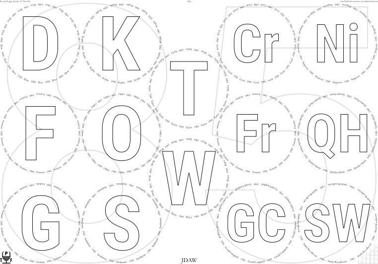
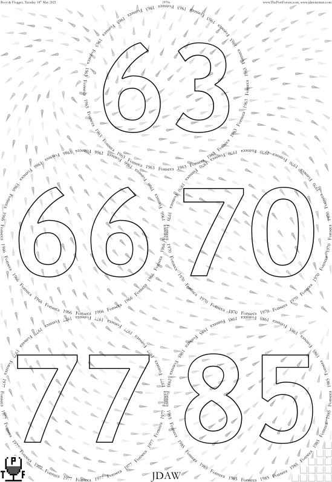
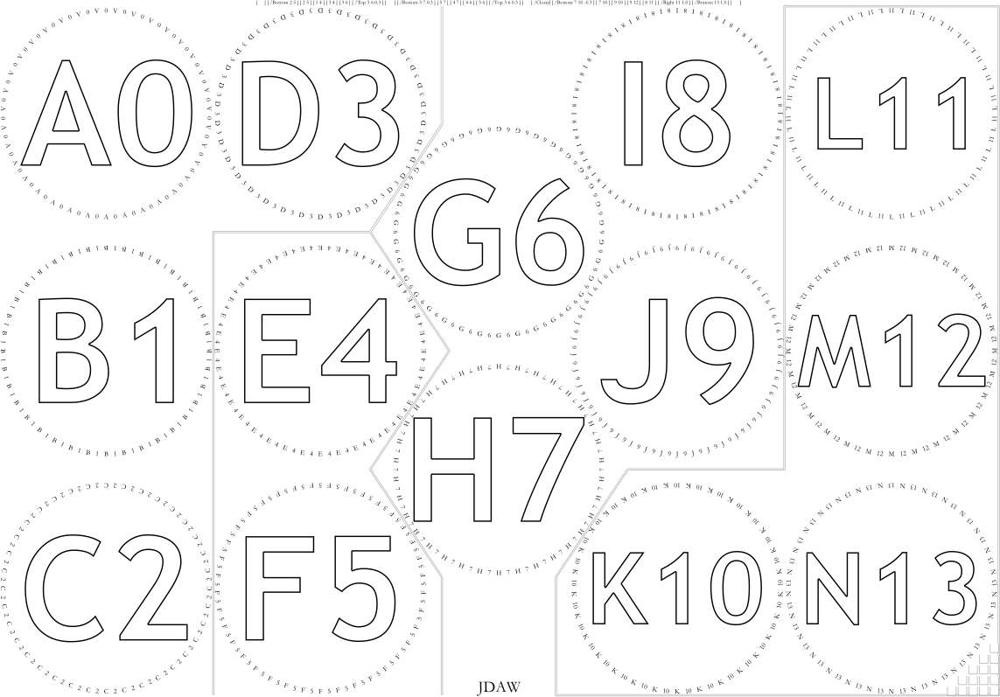
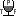

# Page-Level Controls

**Documents**: 
1.  [Introduction, and a first placemat](introduction_first_placemat.md);  
2.  [Compound Strings and non-ASCII characters](compound_strings_characters.md);  
3.  [Fonts and glass decoration](fonts_glasses_decoration.md);  
4.  [Type sizes](type_sizes.md);  
5.  *Page-level controls*;  
6.  [Arrangement of glasses on the page](PackingStyles.md);  
7.  [Non-Glasses Pages](not_glasses.md);  
8.  [Document-level controls](document.md);  
9.  [Code injection](code_injection.md);  
10. [Bitmap images](bitmap_images.md);
11. [Translations](translations.md).

----

## Headers and Footers

Headers and footers can be added to the page. 
Typically these will hold a date, a location, a title, and perhaps some branding&mdash;the author includes URLs. 
There is a little intricacy, to allow tastings split into multiple sessions to have different headers and footers in each session. 
The parameters doing most of the work are `HeadersLeft`, `HeadersCenter`, `HeadersRight`, and their `Footer…` equivalents, though using all of six of these text positions would be very cluttered. 
Each is an array of even length. 

First, the default simple case: make the first item 0, and the second item the required compound string. 
Usually elegance is enhanced by having left and right headers of approximately equal length.

To have different headers on different pages, each array consists of alternate items as in the simple example: number; compound string; number; compound string; &hellip;. 
The number is a page ordering, with the immediately following compound string to be used only if the page ordering is at least this (unless over-ruled by a larger number that is still not bigger than the page ordering).

```PostScript
/HeadersLeft [
	0   (The Pub, Saturday Afternoon)  % If PageOrdering >=0 and <10
	10  (The Hotel, Saturday Evening)  % If PageOrdering >=10
] def
```

Headers are shown in font `HeaderFont`, at size `HeaderFontSize`, with the baseline of the characters a distance `HeaderBaselineFromPageTop` from the top of the page (which should be inside the top margin). 
Likewise `FooterLeftText`, `FooterCenterText`, and `FooterRightText` are shown in `FooterFont` at size `FooterFontSize`, with the top of the footer a distance FooterTopFromPageBottom from page bottom (which should be inside the bottom margin). 
Very rarely one might want the centre heading non-centred (e.g.). 
This can be controlled with `HeaderFooterCenterX`, which is x position of the centre of the relevant item of `HeadersCenter` and of `FootersCenter`.


## GlassesOnSheets and GlassesOnTastingNotePages

More than six or seven glasses would be too many for one sheet of `/A4` or `/USL`. 
If the PaperType is one of these, there must be two sheets, or more. 

Consider:
```PostScript
/GlassesOnSheets [
	[ 0 1 2 3 4 ]
	[ 5 6 7 8 9 ]
] def
```

PostSript arrays start at zero, so if `Titles` etc are of length *n* then the integers mst be &ge;&nbsp;0 and &le;&nbsp;*n*&minus;1. 
The example has two pages. 

Because this is the standard pattern, there is help, in the form of `GlassesOnSheetsMaxPerSheet`. 
The default assignment of `GlassesOnSheets` uses this number, spreading glasses evenly over sheets subjcet to ths constraint. 
And the default value of `GlassesOnSheetsMaxPerSheet` itself depends on `PaperType`:


| `PaperType` |             Size, inches              |            Size, mm           | Default value of<br>`GlassesOnSheetsMaxPerSheet` |
|:-----------:|:-------------------------------------:|:-----------------------------:|:--:|
|    `/A4`    | &asymp; 8.27&nbsp;&times;&nbsp;11.69  | 210&nbsp;&times;&nbsp;297     |  6 |
|    `/USL`   | 8&frac12;&nbsp;&times;&nbsp;11        | 215.9&nbsp;&times;&nbsp;279.4 |  6 |
|  `/USLegal` | 14&nbsp;&times;&nbsp;8&frac12;        | 215.9&nbsp;&times;&nbsp;355.6 |  9 |
|    `/A3`    | &asymp; 16.54&nbsp;&times;&nbsp;11.69 | 420&nbsp;&times;&nbsp;297     | 14 |
|   `/USL2`   |  17&Prime;&nbsp;&times;&nbsp;11       | 431.8&nbsp;&times;&nbsp;279.4 | 14 |

But the `PaperType` can vary. 
E.g., not unusual for 15&ndash;20 glasses:
```PostScript
/PaperType {SheetNum 0 eq {/A3} {/A4} ifelse} def
```
With that one might define:
```PostScript
/GlassesOnSheets [
	[  0 1 13 {} for ]
	[ 14 1 19 {} for ]
] def  % /GlassesOnSheets
```
The PostScript loops save the small effort of typing and checking consecutive integers: &#655;&#7437;&#7437;&#7456;.

Tasting-note pages are configured similarly, with the integer `GlassesOnSheetsMaxPerTNSheet` helping make a default value for `GlassesOnTastingNotePages`.


## BackgroundTexts

Tastings typically have a theme, something shared by most of the wines. 
It is possible to add a background text, scaled to fit the whole page, such as &ldquo;S&rdquo;, &ldquo;RV&rdquo;, or &ldquo;85&rdquo;. 
This is activated by setting `BackgroundTextsGlasses` to `true`. 
Then `BackgroundTextsGlassesTexts` is an array of the same length as `GlassesOnSheets`, containing the strings to be shown on glasses pages. 
The strings should be short: one or two characters is recommended, and are shown in font `BackgroundTextsFont`. 
The text is aligned with `BackgroundTextsAlignmentVertical` being one of `/Middle`, `/Bottom`, `/Top)`; and `BackgroundTextsAlignmentHorizontal` being one of `/Centre`, `/Left`, `/Right`.

<div align="center">



</div>

The code chooses separate *x* and *y* sizes, each as large as possible, subject to the following.
The ratio of the vertical and horizontal font sizes, *y*&divide;*x*, must lie between `BackgroundTextsSquooshMin` and `BackgroundTextsSquooshMax`. 
For non-squooshed text, generally recommended, set both to 1. 
This precise fitting can be done by inserting into the compound string some `{±x Kern}`. The amount of extra kerning required is computed, and appears in the output log &mdash; typically the last page of the PDF.

`BackgroundTextsGlassesSameSizeIfAllOf` determines whether the background texts on different pages are compelled to be the same size. 
They are if all the &lsquo;conditions&rsquo; specified are true. 
Valid conditions are `/False` (always false, so each is fitted separately); `/OnSheetWithSameNumberGlasses` (obvious meaning); `/OnSheetWithSameRadius` (ditto); `/SamePageOrdering` (ditto); `/SamePaperSize` (ditto); `/TextSameLength` (ditto); and `/RadiiShrunkToBeSame` (referring to `ShrinkRadii`).
Neither the *x* nor the *y* size may exceed `BackgroundTextsFontSizeMax`, which defaults to large.

`BackgroundTextsGlassesVerticalMiddling` determines whether the vertical alignment is determined jointly or separately, much like the `VerticalMiddling…` parameters. 
`BackgroundTextsGlassesVerticalMiddling` must be one of `/MatchAll`, `/MatchSamePaperSize`, or `/MatchNone`.
The bounding path of the text is constructed and then BackgroundTextsGlassesPaintCode is executed. 
The default clips then strokes.

Extracts from code that made the example: 

```PostScript
/TitlesFont /RobotoCondensed-Bold def
/BackgroundTextsFont /Roboto-Bold def

/BackgroundTextsGlasses true def
/BackgroundTextsGlassesTexts [
	[(8) {-0.00630915 Kern} (5)]  % First attempt used (85); kern amount in output log.
] def

% Strenghened from default because of conversion to low-resolution bitmap.
/BackgroundTextsGlassesPaintCode {clip 6 setlinewidth 0.9 setgray stroke} def
```

## H&#8322;O boxes


Particularly at a tasting of a sweet fortified wine, drinking water is important. 
By default the glasses pages have a set of little glass icons with which to record water consumption: check one for each glass of water downed. 
Even better, use a diagonal slash for a half glass and a cross for a whole.

This is activated by the parameter WaterBoxes, which takes one of the values: `/Glasses` (so the water boxes appear on the glasses pages); `/TastingNotes` (on the tasting-note pages); `/Both`; or `/None`. 
The number of boxes is WaterBoxesNum, each of which is no bigger than WaterBoxesSizeMax on each side, the gap&divide;box ratio being `WaterBoxesGapProportionSize`.

On glasses pages boxes should appear on the lower-right of the page for right-handed drinkers, and lower-left for left-handers. 
Tasters&rsquo; handedness is set by `LeftHanders`, an array of the text of the name of known left-handers, whether or not at this tasting. 
If a name within `Names` is duplicated, and both are to be left-handed, that name must appear twice within `LeftHanders`.

If there are multiple pages of glasses, by `GlassesOnSheets`, then on which of these pages should water boxes they appear? 
For simplicity, `WaterBoxesOverrideShowEverySheet` being true overrides the complexity in the next few sentences, putting water boxes on every sheet (of glasses or of tasting notes, per `WaterBoxes`). 
But if `WaterBoxesOverrideShowEverySheet` is false, the presence or absence is controlled, for the right handers, by the array of booleans `WaterBoxesShowRight`; and for the lefties by `WaterBoxesShowLeft`. 
`WaterBoxesShowRight` and `WaterBoxesShowLeft` must be the same length as GlassesOnSheets. 
The default values of `WaterBoxesShowRight` and `WaterBoxesShowLeft` refer to `PageOrderingGlasses`: `WaterBoxesShowRight` defaults to true for the last page in each &lsquo;session&rsquo;, and `WaterBoxesShowLeft` for the first. 
There is an analgous parameter `WaterBoxesShowTN`, used for water boxes on the tasting-note sheets.


## Droplets

<div align="center">



</div>

Droplets are a decorative amusement, flowing around the page as if attracted or repelled by spinning charges. 
Activate with the Boolean `Droplets`.

The array `DropletsCharges` is of a length that is a multiple of four, as follows. 
0: An integer, a value of `SheetNum` for this charge, or `/All` meaning all sheets. 
1: A location: this can be an integer, the centre of the `WithinPage` circle on that sheet; or a length array of length two, `[x y]` in which `[0 0]` is bottom-left of the page. 
2: A numeric charge, droplets flowing away from &minus;ve charges and to +ve charges. 
3: A numeric spin; with +ve charge and +ve spin the droplets approach clockwise.

Starting locations of the drops have a distance apart of `DropletsAverageSeparation` adjusted by a random fraction of `DropletsAverageMaxTweakPlusMinus`, and path length is `DropletsPathLength`.

There is a little humour in having a small proportion of the droplets going backwards; a small proportion will be noticed only slowly by the uninitiated, increasing the humour. 
(In the example page are seventeen: seek! Or [peek](images/Droplets_DropletsWhichReversed.png).) 
That proportion is controlled by `DropletsProportionBackwards`, which obviously should be &ge;0 and &le;1. 
The default value is 0.0204 &asymp; 1/49.

The gray and width of each path is controlled by `DropletsOuterGrayEnd`, `DropletsOuterGrayStart`, `DropletsOuterWidthEnd`, `DropletsOuterWidthStart`, `DropletsInnerGrayEnd`, `DropletsInnerGrayStart`, `DropletsInnerWidthEnd`, and `DropletsInnerWidthStart`. 
(But if `DropletsOuterGrayEnd` &ne; `DropletsOuterGrayStart`, or likewise `…Inner…`, the PDF can be multiple megabytes larger.) 
There are also Boolean parameters `PrePourShowDroplets`, `NeckTagsShowDroplets`, and `StickyLabelsShowDroplets`.

```PostScript
/Droplets true def

/DropletsCharges [
	/All  {[MgnL Radii SheetNum get add  PageHeight MgnT sub Radii SheetNum get sub]}   2  120  
	/All  {[PageWidth MgnR sub           MgnB Radii SheetNum get 2 mul add         ]}  -1    0
] def
```


## Separating flights within a page

It is often natural to split a tasting into &lsquo;flights&rsquo; of a few wines. 
If there is lots of table space, and five wines per flight, then this can be arranged as one flight per `/A4` or `/USl` page. 
But sometimes within-page division is necessary. 
And if table space is tight, 14 on `/A3` is more efficient than 12 on 2&times;`/A4`, making more useful the possibility of within-page division.

This is enabled by the Boolean parameter `FlightSeparations`; the hard work of specifying the lines happening with `FlightSeparationLines`. 

`FlightSeparationLines` is fiddly. 
If one wine is added or taken away then that page&rsquo;s element of `FlightSeparationLines` might need to be completely reworked. 
Hence it is recommended that division into flights be saved until late in the planning.
Further, though `FlightSeparationLines` is very much fit for purpose, both controls using and output from `/Curve` are less than perfect. 
I advise that, for easiest control and best output, use only straight lines (no `/Curve`, no `/Clockwise`, no `/Widdershins`).

Let&rsquo;s start with an example, to give a sense of the range of what can be done, and also (part of) the code by which made.

<div align="center">



</div>

```PostScript
/PackingNestingColumnMajor true def

/FlightSeparations true def

/FlightSeparationLines
[
	[  % + SheetNum = 0
		% Straight lines and sharp corners
		[ [/Bottom 2 5]  [2 5]  [1 4]  [3 4]  [3 6]  [/Top 3 6 +0.3] ]
		[ [/Bottom 5 7 +0.3]  [5 7]  [4 7]  [4 6]  [3 6]  [/Top 3 6 +0.3] ]
		[ /Closed  [/Bottom 7 10 -0.3]  [7 10]  [9 10]  [9 12]  [8 11]  [/Right 11 +1.0]  [/Bottom 13 +1.0] ]
	]  % - SheetNum = 0
	[  % + SheetNum = 1
		% Gentle softening of corners, without clinging to the circles
		[ [/Bottom 2 5]  /Corner  [2 5]  /Corner  [1 4]  /Corner  [3 4]  [3 6]  /Corner  [/Top 3 6 +0.3] ]
		[ [/Bottom 5 7 +0.3]  /Corner  [5 7]  /Corner  [4 7]  /Corner  [4 6]  [3 6]  /Corner  [/Top 3 6 +0.3] ]
		[ /Closed  [/Bottom 7 10 -0.3]  /Corner  [7 10]  /Corner  [9 10]  /Corner  [9 12]  [8 11]  [/Top 8 11]  [/Right 11 +1.0]  [/Bottom 13 +1.0] ]
	]  % - SheetNum = 1
	[  % + SheetNum = 2
		% Bezier cubics, so softer than /Corner
		[ [/Bottom 2 5]  /Curve  [2 5]  /Curve  [1 4]  /Curve  [3 4]  /Curve  [3 6]  /Curve  [/Top 3 6 +0.3] ]
		[ [/Bottom 5 7 +0.3]  /Curve  [5 7]  /Curve  [4 7]  /Curve  [4 6]  /Curve  [3 6]  /Curve  [/Top 3 6 +0.3] ]
		[ /Closed  [/Bottom 7 10 -0.3]  /Curve  [7 10]  /Curve  [9 10]  /Curve  [9 12]  [8 11]  [/Top 8 11]  [/Right 11 +1.0]  /Curve  [/Bottom 13 +1.0] ]
	]  % - SheetNum = 2
	[  % + SheetNum = 3
		% Clinging tightly to the circles
		[ [/Bottom 2 5]  [2 5]  [1 4]  [/Clockwise 4]  [/Widdershins 3]  [/Top 3 +1.0] ]
		[ [/Bottom 5 +1.0]  [/Widdershins 5]  [/Clockwise 7]  [/Widdershins 4]  [/Clockwise 6]  [/Widdershins 3]  [/Top 3 +1.0] ]
		[ /Closed  [/Bottom 10]  [/Clockwise 10]  [/HorizontalRightwards 10 +1.0]  [/VerticalUp 11 -1.0]  [/Clockwise 11]  [/Right 11]  [/Right 13]  [/Clockwise 13]  [/Bottom 13] ]
	]  % - SheetNum = 3
] def  % /FlightSeparationLines

```
`FlightSeparationLines` is an array nested about four deep. 
`FlightSeparationLines` is of the same length as GlassesOnSheets. 
Each item of FlightSeparationLines is an array, each of which holds line descriptions, as many as there are lines on that page. 
Each line description is an array, pieces of which can be as follows.

* The first, and only the first, item of a line description may be `/Closed`, which specifies that the line is a closed loop.
* The typical piece is `[a b]`, a and b being integers, which specifies that the line runs through the mid-point of the glass positions a and b, the line being perpendicular to the line connecting the centres. 
So if the circles touch then the line segment touches their joint tangent. Order doesn&rsquo;t matter: `[a b]` and `[b a]` do the same job. 
The integer a can be replaced with `[xa ya]` (making `[[xa ya] b]`), and likewise b with `[xb yb]`.
* There are other allowed interior pieces, including `[/HorizontalLeftwards …]`. This is a horizontal line at a *y* specifed by the &lsquo;&hellip;&rsquo;, which is an average of at least one absolute level, perhaps &plusmn; some real number of radii. 
Absolutes can be /Bottom (with obvious meaning); /Top (ditto); or an integer, in which case the *y* is that of the centre of that circle number. 
Or several integers, in which case the *y* is the average of the centres of those circle numbers. 
optionally supplemented by a real, that number of radii being added to the average. 
So `[/HorizontalLeftwards 0 3 -0.5]` is a horizontal line, at a *y* value of the average of those of circles 0 and 3, minus half a radius. 
This can be thought of as Average[Circle 0&rsquo;s bottom, Circle 3&rsquo;s centre]. 
If the previous item is an arc, the /HorizontalLeftwards means that the left-most intersection is chosen. 
Note that the integer 1 and the real 1.0 are therefore very different, the former referring to the centre of circle 1, the latter to an offset of +1.0 radii. *Mutatis mutandis*, `/HorizontalLeftwards` can be replaced with `/HorizontalRightwards`, `/VerticalDown`, or `/VerticalUp` (which allow absolute *x* positions of `/Left` and `/Right`).
* `[/Left …]` is like `[/HorizontalLeftwards …]`, and at the same *y* value, except that it is certain to touch the left margin. 
Again *mutatis mutandis*, `[/Right …]`, `[/Top …]`, and `[/Bottom …]`. 
`[/Left]`, with no specification of the *y* value, reaches the left margin at whatever angle the neighbouring segment causes the line to travel. 
It is not sensible for more than one of these to occur consecutively. 
With obvious variations, `[/Right]`, `[/Top]`, and `[/Bottom]`. 
It is easiest to think about these margin specifications as being of two types: if the position is specified, the line is perpendicular to the margin; if unspecified, parallel.
* `[/Clockwise a]` draws a part of clockwise circle centered on glass position a; `[/Widdershins a]` being anti-clockwise. 
(&ldquo;Widdershins&rdquo;? [Widdershins](http://en.wikipedia.org/wiki/Widdershins)!) 
There are variants, `[/Clockwise a b c]` and `[/Widdershins a b c]`, in which the radius of the arc is half the distance between the centres of circles b and c. 
As above, the integer a can be replaced with [xa ya].
* Between two pieces the non-array item `/Corner` causes there the sharp corner between two straight lines to be replaced with an arc, with radius `FlightSeparationsCornerRadius`. 
* Between two pieces the non-array item `/Curve` causes what would have been two straight lines to be replaced with a B&eacute;zier curve made with the PostScript command `curveto`. 
Perhaps this is now deprecated, `/Corner` being preferred.

In [the PDF of examples](images/FlightSeparations.pdf) the header shows that page&rsquo;s item of `FlightSeparationLines` (i.e., `FlightSeparationLines` is an array one deeper than the header). 
If using `FlightSeparations` it is strongly recommended that these examples be examined and appropriate parts used as a starting draft. 

The path can be `stroke`d, `clip`ped or `fill`ed by the code `FlightSeparationPaintCode`, which has a default stroke that is complicated but elegant. 
Use of `fill` is discouraged, as it impedes comparison of colours of the wines. 
If `FlightSeparationPaintSeparately` then `FlightSeparationPaintCode` is invoked after each line, the variable `FlightSeparationLineNum` being set to the appropriate integer &ge;0. 
If `FlightSeparationPaintSeparately not`, then all the lines on the current page are drawn, after which is the single call of `FlightSeparationPaintCode`. 
The former is better if the format is not constant; the latter preferred if overlapping or crossing lines are to be double-stroked.

Some control over the radius of the `/Clockwise`/`/Widdershins` arcs is sometimes possible. If any circles touch, the radius of the arcs equals that of the circles. 
If no circles touch (probably because of `MaxRadius` or `ShrinkRadii`) then `FlightSeparationArcRadiusControl` controls the radius. 
`FlightSeparationArcRadiusControl` should be both &ge;0 and &le;1; the default being the maximum: if it is 0, the radius of the arcs is that of the circles; if 1, the radius is the half the distance between the closest circles; if between, between.

There is a [bug in (at least some versions of) Adobe Distiller](http://groups.google.com/forum/#!topic/comp.lang.postscript/amUp28S-JFM), such that if `FlightSeparationPaintSeparately` is `false` and there are multiple lines on one page (&hArr; `FlightSeparationLines SheetNum get length` &ge; 2), the apparent ends of some lines are controlled by `setlinejoin` rather than `setlinecap`. 
It is a small aesthetic imperfection, but an aesthetic imperfection nonetheless. 
The problem can be avoided if no line begins where the previous one ended, achievable by reversing the direction of individual lines, or by re-ordering the set of lines.


## The Port Forum Icon  

The majority of the placemats created by the author are for tastings arranged via [www.ThePortForum.com](http://www.theportforum.com/). 
To control the placement of a ThePortForum icon the parameter `ThePortForumIconPlacement` is set to one of `/None`, `/LowerLeft`, `/LowerRight`, `/UpperLeft`, `/UpperRight`, `/LowerNonWaterBox`, `/UpperNonWaterBox` or `/UpperNonWaterBox`, the last three evaluating to left or right according to the side on which the WaterBoxes are placed. 
Alternatively, for multiple icons on the page, ThePortForumIconPlacement can be an array of any of the non-`/None` of these possibilities. 

Icons on the tasting-note pages are controlled by ThePortForumIconTastingNotePlacement, with permitted values `/None`, `/LowerLeft`, `/LowerRight`, `/UpperLeft`, `/UpperRight`, `/LowerNonName`, `/UpperNonName` and `/UpperName`. 
Whether or not the icons are shown in colour is set by the boolean `ThePortForumIconColour`.

