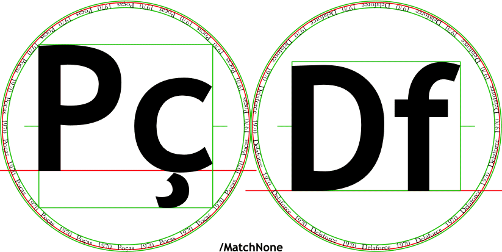

# Type sizes

**Documents**: 
1.  [Introduction, and a first placemat](introduction_first_placemat.md);  
2.  [Compound Strings and non-ASCII characters](compound_strings_characters.md);  
3.  [Fonts and glass decoration](fonts_glasses_decoration.md);  
4.  *Type sizes*;  
5.  [Page-level controls](page_level.md);  
6.  [Arrangement of glasses on the page](PackingStyles.md);  
7.  [Non-Glasses Pages](not_glasses.md);  
8.  [Document-level controls](document.md);  
9.  [Code injection](code_injection.md);  
10. [Bitmap images](bitmap_images.md);
11. [Translations](translations.md).

----

## Introduction

There are lots of fussy controls over the sizing of fonts. 
A few of these controls are, or are sometimes, *worthwhile*. 
Many others are *superfluous* &mdash; of use not more than rarely.

The controls more likely to be useful are sectioned *worthwhile*, the very fussy *superfluous*.

In the author&rsquo;s old placemats, the most often changed, in order from most to least, are as follows.

* `FontSizesRatioTitlesMin`, typical values being `99` (&rArr; all forced to same size), `1` (&rArr; no effect), and other values &ge;`1.05` and &le;`2`.

* `TitleMaxHeightProportionInnerRadius`, typical values being either `2` (&rArr; &infin;), or in the range `1.25`&ndash;`1.75`. 

* `BelowtitleMaxFontSizeProportionTitles`, to values in the range `0.6666`&ndash;`0.5`. Also, but less often, and to similar values, `OvertitleMaxFontSizeProportionTitles` and `AbovetitleMaxFontSizeProportionTitles`.

* `CircletextMaxFontSizeAbsolute` to values `6`&ndash;`16`, big values also necessitating `/CircletextMaxFontSizeProportionRadius 1 def`.

But, before detail can be explained, a flow of action is needed.

1. First, the circle text is sized. 
There are two parameters givng an indicative size, and others controlling whether this may be improved. 

2. Then the `Titles` are sized, to use all the available space. 
These are subject to one-at-a-time constraints. 
That could still leave an ugly profusion of type sizes: one would not want different circles having their `Titles` set in 100pt, 104pt, 108pt, 108pt. 
So then there are constraints on which sets must be the same. 
For each set, all are set to the type size of the smallest. 
The process is repeated over the various sets, until it terminates.

3. Then the `Abovetitles`, `Belowtitles`, and `Overitles` are sized. 
Again there are one-at-a-time constraints, and equality constraints.

These should be tackled in order.

## Circlearrays sizing

### Worthwhile

The circle text is initially set to be the smaller of `CircletextMaxFontSizeAbsolute`, and radius &times; `CircletextMaxFontSizeProportionRadius`. 
Also relevant is `CircletextsMinNumSpacesBetween`, the gap between the items of `Circlearrays`, measured in space widths.

### Superfluous

Next, the font size can reduced to satisfy `CircletextsMinCopies`.

Assume that these cause an item of `Circlearrays` to fit around its circle 2.999 times. 
This would be truncated to 2 times, with white space occupying the &lsquo;0.999&rsquo; remainder. 
Self-evidently, it would be aesthetically better to reduce the font size slightly, such that the text fits 3+&epsilon; times, making the gaps very close to `CircletextsMinNumSpacesBetween` space widths.

By default, the font size is slightly adjusted for better aesthetics. 
Unless you need the font size to equal some exact value, allow this optimisation to do its magic.

This tweaking of the font size is enabled by the Boolean `CircletextsTweakSize`. 
There would be merit to allowing the first step of the optimusation to be an increase, permitted by the Boolean `CircletextMaxFontSizeMayBeSlightlyExceeded`.

The number of copies of the `Circletexts` is bounded above by `CircletextsMaxCopies`; when this is invoked the the number of copies that would otherwise appear is on the top of the stack, so `CircletextsMaxCopies` could be code referring to it, such code advisedly starting with a &ldquo;`dup`&rdquo;.

Relevant when glasses spill over multiple pages, `CircletextsSameFontSizeIfRadiiShrunkToBeSame`, constrains the size over pages compelled to have the same radius (see `ShrinkRadii`).
(Technical note: `CircletextsSameFontSizeIfRadiiShrunkToBeSame` should have the same Boolean value over any such set of pages. 
Typically this is most easily achieved by having it depend on `PageOrderingGlasses SheetNum get` or on `ShrinkRadii SheetNum get`, rather than directly on `SheetNum`.)

## Titles sizing

Broadly, the `Titles` etc fit inside the `Circlearrays`. 

### Superfluous

Inside which there is a `ExclusionAnnulusProportionInnerRadiusTitlesAboveBelow`, defaulting to 0. 

`TitleMaxHeightProportionInnerRadius` ensures that the likes of &ldquo;&dagger;&rdquo; isn&rsquo;t grossly outsized. 

It would be ugly for there to be font sizes marginally different: 100pt, 104pt, 108pt, 108pt. 
The next few controls define sets, the font size of all of which are reduced to the smallest in the set.

### Worthwhile

* If larger&divide;smaller &le;`FontSizesRatioTitlesMin` , then the larger is collapsed to the smaller. 
Setting this to a large value causes all to be the same size. 
Setting this to any value &le;1 causes this to be ignored. 
Default is 1.1892 &asymp;&nbsp;&#8732;2. 
It is one of the few sizing parameters which I do change.

### Superfluous

* `FontSizesTitlesNotSmallerIfTitlesNotLonger` is a Boolean, which can constrains the size of a &lsquo;W&rsquo; to be no smaller than that of a &lsquo;ii&rsquo;, and ensures that the latter&rsquo;s font size equals that of a &lsquo;SW&rsquo;. Observe that this being true compels `Titles` of the same character count to be the same size.

* If two pages are in different sessions (lunch, evening) then there is no need for their sizes to be worked togther. 
`FontSizesSetsGlassesPages` is an array, of the same length as `GlassesOnSheets`; pages are worked together if their elements are `eq`ual. 
The default value of `FontSizesSetsGlassesPages` is `PageOrderingGlasses`, which is typically used for separation into sessions.

* `FontSizesTitlesEquivalences` is the same length as `Titles`, and if two elements of this are `eq`ual then the font sizes must be equal.

With the size of the Titles set, the space above and below can be used for the `Abovetitles` and `Belowtitles`, which are done jointly with the `Overtitles` (henceforth, **A**, **B**, **O**).

### Worthwhile

* Sizes are one-at-a-time constrained by `AbovetitleMaxFontSizeProportionTitles`, `BelowtitleMaxFontSizeProportionTitles`, and `OvertitleMaxFontSizeProportionTitles`.

* Should the sizes of the A, B, and O be independent? 
`FontSizesSetsAboveBelowOver` is an array of length 3, the elements referring to A, B, and O. 
Equal elements &rArr; considered together. 
As a guide, if different fonts &hArr; not together.

### Superfluous

Analagous to the `…Titles…` are:

* `ExclusionAnnulusProportionInnerRadiusTitlesAboveBelow`, `ExclusionAnnulusProportionInnerRadiusOvertitles`, and `FontSizesRatioAboveBelowOverMin`, the last of which defaults to 999, so forcing all to be the same size;

* `FontSizesAbovetitlesEquivalences`, `FontSizesBelowtitlesEquivalences`, `FontSizesOvertitlesEquivalences`;

* and `FontSizesAboveBelowOverNotSmallerIfTitlesNotLonger`.

## VerticalMiddling

### Superfluous

The VerticalMiddling parameters are for the fussy. 
The default values will almost always suffice.

How are the Titles to be vertically aligned? 
Centring each by itself causes their baselines to be misaligned, sometimes by an annoying small amount. 
So some sets should have a common baseline. 
But even that is wrong: vertically aligning &ldquo;P&ccedil;&rdquo; and &ldquo;Pi&rdquo; looks wrong: the tail of the cedilla, or of a &lsquo;g&rsquo; or of a &lsquo;y&rsquo;, just seems aesthetically different. 
So the vertical alignment should be to a no-descender string.

`VerticalMiddlingTitles` and `VerticalMiddlingOvertitles` must be one of `/MatchNone`, `/MatchRow`, `/MatchPage`, `/MatchAll`, or `/MatchString`. 
The last of these causes it to use `VerticalMiddlingStringTitles` and `VerticalMiddlingStringOvertitles`.

But there are exceptions. 
Whatever the alignment of &ldquo;W09&rdquo;, the likes of &ldquo;&dagger;&rdquo; feel somehow different, and should be independently vertically centred. 
So `VerticalMiddlingTitlesAlwaysMatchNone` and `VerticalMiddlingOvertitlesAlwaysMatchNone`are an array of exceptions, by default including:
&dagger; &Dagger; $ &pound; &euro; &yen; + ++ +++ *  &spades; &hearts; &diams; &clubs; &times; &bull; &middot; &loz; 
&alpha; &beta; &gamma; &delta; &epsilon; &zeta; &eta; &theta; &iota; &kappa; &lambda; &mu; &nu; &xi; &omicron; &pi; &rho; &sigma; &tau; &upsilon; &phi; &chi; &psi; &omega; 
&#x2609; &#x263F; &#x2640; &#x2641; &#x2642; &#x2643; &#x2644; &#x2645; &#x2646; &#x2647;

The even more pedantic parameters `VerticalMiddlingIncludeBaselineTitles` and `VerticalMiddlingIncludeBaselineOvertitles` say that, if the relevant string is wholly outside the baseline (i.e., bottom is positive or top is negative), the baseline is nonetheless included.
