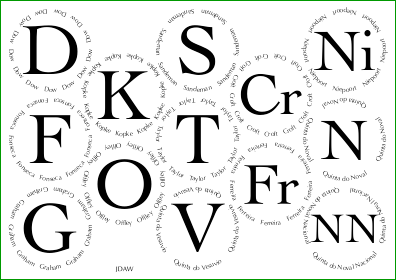

# Placemat Software #

**Links to software**: 
&#9654;&#xFE0E;&nbsp;**The main program, [placemat.ps](PostScript/placemat.ps?raw=1)**&nbsp; 
&#9654;&#xFE0E;&nbsp;For a catalogue of available fonts, [fonts_illustrated.ps](PostScript/fonts_illustrated.ps?raw=1)&nbsp; 
&#9654;&#xFE0E;&nbsp;To list the glyphs available in a single font, [glyph_log.ps](PostScript/glyph_log.ps?raw=1)

**Links to documentation**: 
&#9654;&#xFE0E;&nbsp;[Introduction,&nbsp;and&nbsp;a&nbsp;first&nbsp;placemat](Documentation/introduction_first_placemat.md#readme)&nbsp; 
&#9654;&#xFE0E;&nbsp;[Fonts&nbsp;and&nbsp;glass&nbsp;decoration](Documentation/fonts_glasses_decoration.md#readme)&nbsp; 
&#9654;&#xFE0E;&nbsp;[Compound&nbsp;Strings&nbsp;and&nbsp;non&#8209;ASCII&nbsp;characters](Documentation/compound_strings_characters.md#readme)&nbsp; 
&#9654;&#xFE0E;&nbsp;[Page&#8209;level&nbsp;controls](Documentation/page_level.md#readme)&nbsp; 
&#9654;&#xFE0E;&nbsp;[Arrangement&nbsp;of&nbsp;glasses&nbsp;on&nbsp;the&nbsp;page](Documentation/PackingStyles.md#readme)&nbsp; 
&#9654;&#xFE0E;&nbsp;[Non&#8209;Glasses&nbsp;Pages](Documentation/not_glasses.md#readme)&nbsp; 
&#9654;&#xFE0E;&nbsp;[Document&#8209;level&nbsp;controls](Documentation/document.md#readme)&nbsp; 
&#9654;&#xFE0E;&nbsp;[Type&nbsp;sizes](Documentation/type_sizes.md#readme)&nbsp; 
&#9654;&#xFE0E;&nbsp;[Translations](Documentation/translations.md#readme)&nbsp; 
&#9654;&#xFE0E;&nbsp;[Code&nbsp;injection](Documentation/code_injection.md#readme)&nbsp; 
&#9654;&#xFE0E;&nbsp;[Bitmap&nbsp;images](Documentation/bitmap_images.md#readme)&nbsp; 
&#9654;&#xFE0E;&nbsp;[Debugging](Documentation/debugging.md#readme)

## About ##

This PostScript program makes placemats for tastings of Port, of Madeira, whisky, beer, wine, etc.

At such a tasting there will be many glasses, each person having one for each drink to taste. 
It is important to avoid confusion about what is in each glass. 
Hence labelling is needed, best done with beautiful printed pages on which glasses can sit. 
And having done that, there might also be need for matching pages:  
* on which to write tasting notes,  
* to organise pre-pouring,  
* to display the corks,  
* to record votes for the Wine Of The Night, and  
* to label each person&rsquo;s place-setting (so everybody knows who everybody else is),  
* to label decanters and bottles,  
* to assist with computing the split of the costs, allowing for bottles provided.

This PostScript program creates all the paperwork useful for managing such tastings, large or small. 
Lots of previous output is at [jdawiseman.com/papers/placemat/placemats_list.html](http://www.jdawiseman.com/papers/placemat/placemats_list.html) (lots: that page has &gap;&#8239;25&#8239;MB of PNGs, so don&rsquo;t access using mobile data).

New users should start at the [*Introduction, and a first placemat*](Documentation/introduction_first_placemat.md#readme).

## History ##

Code started November 2002 for the private use of J.&#8239;D.&#8239;A.&#8239;Wiseman; 
in September 2005 uploaded to [jdawiseman.com](http://www.jdawiseman.com/papers/placemat/placemat.html); 
in January 2021 transferred to [GitHub](http://github.com/jdaw1/placemat/#readme).

Since 2005, there have been &gap;&nbsp;&frac12;k versions of this software.

## Be nice ##

The [GitHub Community Guidelines](http://docs.github.com/en/github/site-policy/github-community-guidelines) are good. Obey.
